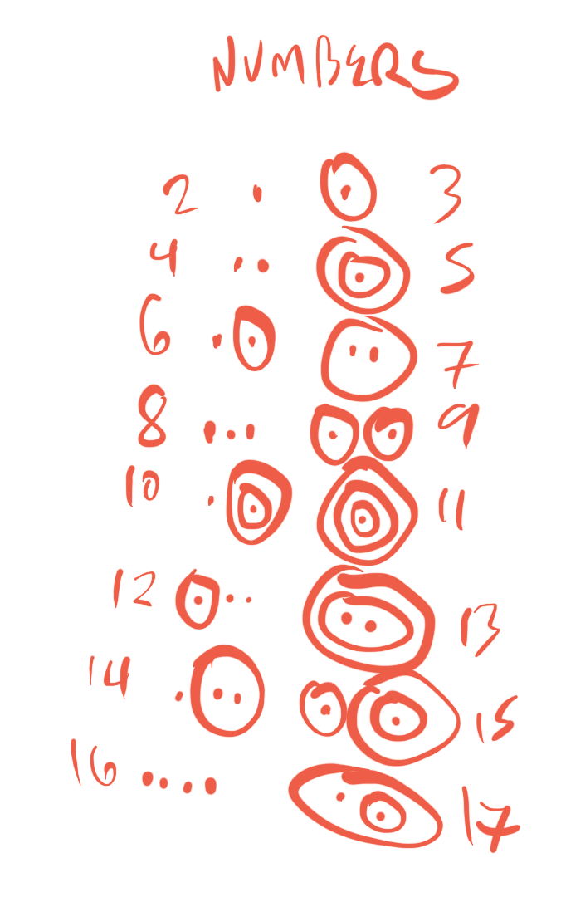

lessons/raw/L_001.md

---

title: Background
permalink: /background/
order: 2
---

<span class='spoken btnOnly'> <button class='speak' type='button' data-ipa='fχθʌɣnzi ivəɮ ɻxiʔəɻ vɣʌv suɸuv fχθʌɣiɮʃiʔuβ vɣʌv iθðzxi ʌɮðɻiʃ fχθʌɣ jij'>🔈</button>  </span> <strong>fhtognzi ivol rxi'or vgov supuv fhtogil5i'ub vgov itdzxi oldri5 fhtog yiy</strong>

`dead-NEG DET.DIST abide-REL can eternity-ADV.DER sleep-FFUT-CONJ.and can aeon-PL-TEMP strange death EMPH`

/fχθʌɣnzi ivəɮ ɻxiʔəɻ vɣʌv suɸuv fχθʌɣiɮʃiʔuβ vɣʌv iθðzxi ʌɮðɻiʃ fχθʌɣ jij/

_That is not dead which can eternal lie, and with strange aeons even death may die._

## A pidgin for Lovecraftian cultists

A [pidgin](https://en.wikipedia.org/wiki/Pidgin) is a language that evolves among two populations of people that cannot otherwise communicate with each other. **Lugso is a pidgin that emerged among cultists who regularly communicate with the Elder Gods.**

It is NOT a language-between-languages, however. Lugso is a language-between-worlds, because the Elder Gods not only do not speak in human tongues, but they do not _think_ in human concepts. Lugso represents not only eldritch _speech_, but eldritch _thought_ - or, as near as humans can manage, without giving themselves an internal hemorrhage. It is the mediation between human thought and the least sophisticated conceits of the unspeakable Old Ones. **It is a "meta-pidgin", connecting our fragile mental models with the biting winds of their reality.**

## Dedication

Lugso is dedicated to the man and woman showed me that not only is it possible to experience the indescribable truths undergirding all of creation (as Lovecraft feared that we could), but also that it is good and even beautiful to do so. It is dedicated to the two human beings who rescued me from a futile search for comprehension of the incomprehensible (as Lovecraft dared never imagine), and taught me instead to seek unity with Unity, and being united to Being. To the Sacred Heart of Jesus and the Immaculate Heart of Mary, on October 15th 2022 I dedicate and consecrate this language and all of its good effects, for eternity.

I also dedicate it to my wife, who I can only pray forgives me for spending so much time on this silly little thing.
lessons/raw/L_010.md

---

title: Phonology
permalink: /phonology/
order: 3
---

## Phonemic Inventory

The initial idea was for Lugso's gimmick to be "only fricatives", but the wisdom of moderation won the day - it's now just *mostly* fricatives.

Great pains have been taken to preserve the feel and sense of the "big names" like Cthulhu, Yog-Sothoth, Shub-Niggurath, and so on - the conceit is as follows: Lovecraft *heard* these names spoken by real cultists *in Lugso*, and transcribed them into English as we know them. Lugso thus represents *the original language from which the famous monikers were derived.* It is my hope that phonetically, this has been done convincingly.

Consonants|bilabial|labiodental|dental|postalvoelar|alvoelar|alvoelar-lateral|velar|uvular|glottal
|-|-|-|-|-|-|-|-|-
fricative|ɸβ|fv|θð|ʃʒ|sz||xɣ|χ
approximant||||j|ɻ|ɮ|
nasal|||||n||
stop|||||||ʔ

Vowels|front|central|back
|-|-|-
high|i||u
mid||ʌ/ə

ʌ/ə is the same phoneme, but ʌ is stressed and ə is unstressed.

### Importing names from English - rules for special sounds

As a general rule, the English sound, if it is a fricative, remains a fricative. If the English sound is a stop, it becomes a fricative at the same location. There are several exceptions to this, however.

English sound (ipa) | Lugso sound (ipa) | Lugso letter (latin)
|-|-
m|β|b
d|ð|d
t|θ|t*
θ ("th")|θx|tk
tʃ ("ch")|θʃ|t5
dʒ ("zh", as in _gara**ge**_)|zʒ|z3
l|ɮ|l
r|ɻ|r
k|x|k
g|ɣ|g
h|χ|h
u|u|u
i|i|i
a/o|ʌ|o

\* "t" is a dental stop, so its conversion should be _s_, but _s_ already exists in Lugso, so t becomes θ. Same with d and z - instead, d becomes ð.

## Phonotactics

In general: pronounce exactly as written, even if impossible. There are 2 exceptions:

1. Separate duplicate phonemes with glottal stops.
1. Separate adjacent vowels with glottal stops (even between words).

Brief pauses between words are encouraged.

**I've added a dot below the last letter of each morpheme (aka unit of meaning), to assist you in visually scanning them as you learn and read. These dots are ornamental and serve no other purpose.**

## Morphology

`(c)(c)(c)v(c)(c)`: Each syllable has a vowel, up to 3 onset consonants, and up to 2 coda consonants. Words will occasionally possess strings of 5 consonants, and may possess any number of syllables. Good luck!

Stress is always placed on the first syllable of each word. Duplicate phonemes are stressed as semi-syllables. Fortunately, most core words are only one or two syllables, although suffixes often increase that count.

lessons/raw/L_020.md

---

title: Dictionary
permalink: /dictionary/
order: 3
---

Abbreviations (e.g. ADV, NEG) taken from [linguistic glossing abbreviations](https://en.wikipedia.org/wiki/List_of_glossing_abbreviations).

<iframe
    style="height:50vh; width: 100%"
    src="https://docs.google.com/spreadsheets/d/e/2PACX-1vSWFFpmDmSmKMhZXKEo3FLlVxeDIQyqjZNZREjuJbOWBa9Rt5AVbd5K3GKoFhvndACUwSbHZwyPOco4/pubhtml?gid=0&amp;single=true&amp;widget=true&amp;headers=false"
></iframe>

lessons/raw/L_030.md

---

title: Syntax
permalink: /syntax/
order: 3
---
## Lesson Vocab

English|Part of Speech|IPA|Lugso|Comments
|-|-|-|-
ACC|N suffix|<span class='spoken '> <button class='speak' type='button' data-ipa='iɻ'>🔈</button> <span class='ipa'>iɻ</span> </span>|ir|accusative case - to N, towards location
consume|VB|<span class='spoken '> <button class='speak' type='button' data-ipa='χuf'>🔈</button> <span class='ipa'>χuf</span> </span>|huf|
i|1SG|<span class='spoken '> <button class='speak' type='button' data-ipa='nʌ'>🔈</button> <span class='ipa'>nʌ</span> </span>|no|
you|2SG|<span class='spoken '> <button class='speak' type='button' data-ipa='ðʌ'>🔈</button> <span class='ipa'>ðʌ</span> </span>|do|
beast|N|<span class='spoken '> <button class='speak' type='button' data-ipa='θɮu'>🔈</button> <span class='ipa'>θɮu</span> </span>|tlu|
fly|VB|<span class='spoken '> <button class='speak' type='button' data-ipa='sʌʒ'>🔈</button> <span class='ipa'>sʌʒ</span> </span>|so3|travel through gas
swim|VB|<span class='spoken '> <button class='speak' type='button' data-ipa='vux'>🔈</button> <span class='ipa'>vux</span> </span>|vux|travel through liqud

## Word Order (Part I)

In English, we say, "I fly". In Lugso, the cultist says, "fly I". Verb comes before subject.

<span class='spoken btnOnly'> <button class='speak' type='button' data-ipa='sʌʒ nʌ'>🔈</button>  </span> <strong>so3 no</strong>

`fly 1SG`

---

<span class='spoken btnOnly'> <button class='speak' type='button' data-ipa='vux θɮu'>🔈</button>  </span> <strong>vux tlu</strong>

`swim beast`

_The/A beast swims._

## Word Order (Part II)

In English, we say, for example, but hopefully not too often, "You consume me." We know based on the fact that "You" comes before "consume" that it is you who are doing the consuming, and from the fact "me" comes after "consume" that it is I who am being consumed. In linguistic terms, you are the subject, consume is the verb, and I am the object. Order: S-V-O.

Lugso has word order V-O-S: a cultist says, "consume me you".

### Verb-Object-Subject

But how does he know what's the subject and what's the object? In English, we change "I" to "me", or "he" to "him" when the speaker is an object - _I_ hit **him**, but _he_ hits **me** - in Lugso, the cultist appends **-ir**, which performs the same transformation of any given noun. This is known as the _accusative case_.

### Accusative case

A noun obtains the accusative case if the verb is _being done to_ it.

<span class='spoken btnOnly'> <button class='speak' type='button' data-ipa='χuf nʌʔiɻ ðʌ'>🔈</button>  </span> <strong>huf no'ir do</strong>

`consume 1SG-ACC 2SG`

_You consume me._

---

A noun also obtains accusative if it is the _destination of a movement._

<span class='spoken btnOnly'> <button class='speak' type='button' data-ipa='sʌʒ ðʌʔiɻ θɮu'>🔈</button>  </span> <strong>so3 do'ir tlu</strong>

`fly 2SG-ACC beast`

_The/A beast glides to you._

---

We will cover more **noun cases** in a future lesson.

## Suffix Order

Lugso leverages a great number of suffixes. The grammatical order is as follows:

### Noun suffixes

1. Root noun
2. Plural suffix
3. Case marker
4. Negation
5. Question suffix

### Verb suffixes

1. Root verb
2. Tense
3. Mood
4. Negation
5. Subordinating suffix
6. Question suffix
7. Relative or Conjunction

lessons/raw/L_031.md

---
title: Writing System

permalink: /writing-system/
order: 3
---
## Latin alphabet writing system

**IPA**|ɸ|β|f|v|θ|ð|ʃ|ʒ|s|z|ɮ|x|ɣ|χ|j|ɻ|i|u|ʌ|n
**Latin**|p|b|f|v|t|n|5|3|s|z|l|k|g|h|y|r|i|u|o|n

## Tentacular Abjad

Inverse of normal abjad - vowels are main body of writing; consonants are diacritics.

### Vowels

Vowels form the main body of each word. Words are represented by one connected group of tentacles.

ipa|latin|tentaculary
|-|-
i|i|a tentacle sweeping upward
u|u|a tentacle sweeping downward
ʌ|o|a flat tentacle


Vowels are the thickest tentacles in a word. Loops in vowels are most often ornamental.

### Consonants

Consonants are tentacles that branch off of their root vowels.

A consonant on the left (u/i) or top (o) of its vowel comes prior to the vowel (the _onset_ of the syllable). A consonant on the right (u/i) or bottom (o) of its vowel comes after the vowel (the _coda_ of the syllable).


    1: a plain tentacle branching off the vowel.
    2: a tentacle that splits into two tentacles.
    L: a tentacle terminating in a loop (no trailing tip).
    X': a self-looping tentacle.
    XY: a tentacle composed of an X followed by a Y.

ipa|latin|tentaculary
|-|-
ɸ|p|1
β|b|1'
f|f|11
v|v|1'1
θ|t|2
ð|d|2'
ʃ|5|12
ʒ|3|1'2
s|s|21
z|z|2'1
x|k|22
ɣ|g|2'2
ɮ|l|L
χ|h|L'
ɻ|r|1L
j|y|2L
n|n|2L'


### Examples

The syllables have been hyphenated to assist you in seeing the breakdown.

<span class='spoken btnOnly'> <button class='speak' type='button' data-ipa='ɮuɣsə ɣuʃɮiðsə sʌθsə'>🔈</button>  </span> <strong>lugso gu5lidso sotso</strong>

`blood-GEN deity_intelligent-PL-GEN thought-GEN`


As you can see, loops in vowels can be ornamental, but loops in consonants are not.

Additionally, in compound nouns, loops serve as hyphens.

---

Where there are multiple consonants in the onset or the coda of a syllable, they are evaluated left-right, top-bottom.


This example is nonsense (for now), and a bit cramped, but you can see how on u or i, the top consonant precedes the bottom, and on the o, the left precedes the right.

### Mandatory: Loops for disambiguating vowel clusters

Sometimes lone "o" appears in words, for example the name "huoxin" hu+o+xin.

To disambiguate the bare "o", use two loops in the vowel line. below: huoxin vs. huxin.

The small, straight lines here are a shorthand for drafting.


### Optional: Capping consonants

When a word begins or ends with one consonant, the consonant can cap the vowel rather than branching off it, **unless that consonant is _b_ or _p_**.

#### Style 1: Uncapped

<span class='spoken btnOnly'> <button class='speak' type='button' data-ipa='ɣʌɻn χuɸznusə χʒunβðjə'>🔈</button>  </span> <strong>gorn hupznuso h3unbdyo</strong>

`organization_natural human-female-GEN gorge-PTCP.PAST.PASS`

_Order of the Bloated Woman_ (from _Masks of Nyarlathotep_, Shanghai chapter.)

[ IMAGE PENDING REDRAW ]

Note the ornamental loops in each word. Technically, it is ambiguous with **ogorno hupsoniso hZunbokub**, but thankfully, that means nothing. Be advised that you may wish to double-check whether your ornamental loops create unintended - or intended - double meanings.

#### Style 2: Capped

<span class='spoken btnOnly'> <button class='speak' type='button' data-ipa='jʌɮsiɻ'>🔈</button>  </span> <strong>yolsir</strong>

`child-ACC`


### Optional: Vowel stacking

In longer words, sometimes you observe many subsequent o's. In these cases, you may "stack" the horizontal segments for aesthetic purposes:


<span class='spoken btnOnly'> <button class='speak' type='button' data-ipa='jʌɮs njʌɻɮəsχəθəɸsə'>🔈</button>  </span> <strong>yols nyorloshotopso</strong>

`child nyarlathotep-GEN`

_child of Nyarlathotep_. (not Nyarlathotep's child - subtle difference!)

If your long word with many o's also has u's or i's, make sure they are vertical, to avoid confusion:

[ IMAGE PENDING REDRAW ]

<span class='spoken btnOnly'> <button class='speak' type='button' data-ipa='ɣʌɮəɮəɮzənɸzuvʒ'>🔈</button>  </span> <strong>golololzonpzuv3</strong>

`infinite-NMLZ.DER-PROL`

Note the lack of a loop on the last syllable of **golololzonpzuv3** - a loop would make the bottom horizontal read as **lzofoib**.

lessons/raw/L_040.md

---
title: Adjectives, Adverbs, Plurals

permalink: /adjectives-adverbs-plurals/
order: 3
---

## Lesson Vocab

English|Part of speech|IPA|Lugso|Comment
|-|-|-|-
ADV.DER|suffix|<span class='spoken '> <button class='speak' type='button' data-ipa='uv'>🔈</button> <span class='ipa'>uv</span> </span>|uv|-ly
aeon|N|<span class='spoken '> <button class='speak' type='button' data-ipa='iθ'>🔈</button> <span class='ipa'>iθ</span> </span>|it|
beautiful|ADJ|<span class='spoken '> <button class='speak' type='button' data-ipa='ʌɮðɻiʃ'>🔈</button> <span class='ipa'>ʌɮðɻiʃ</span> </span>|oldri5|"eldritch"
bite|VB|<span class='spoken '> <button class='speak' type='button' data-ipa='iχʃ'>🔈</button> <span class='ipa'>iχʃ</span> </span>|ih5|
black|ADJ|<span class='spoken '> <button class='speak' type='button' data-ipa='ʒxiɣ'>🔈</button> <span class='ipa'>ʒxiɣ</span> </span>|3xig|
blood|N|<span class='spoken '> <button class='speak' type='button' data-ipa='ɮuɣ'>🔈</button> <span class='ipa'>ɮuɣ</span> </span>|lug|
infinite|ADJ|<span class='spoken '> <button class='speak' type='button' data-ipa='ɣʌɮəɮəɮ'>🔈</button> <span class='ipa'>ɣʌɮəɮəɮ</span> </span>|gololol|
invisible|ADJ|<span class='spoken '> <button class='speak' type='button' data-ipa='zux'>🔈</button> <span class='ipa'>zux</span> </span>|zux|
it|3SG|<span class='spoken '> <button class='speak' type='button' data-ipa='un'>🔈</button> <span class='ipa'>un</span> </span>|un|he, she, it
PL|N suffix|<span class='spoken '> <button class='speak' type='button' data-ipa='ð'>🔈</button> <span class='ipa'>ð</span> </span>|d|plural suffix

## Adjectives

In English, we say "red blood". In Lugso, we say "blood red". Adjectives _follow_ the noun that they modify.

<span class='spoken btnOnly'> <button class='speak' type='button' data-ipa='ɮuɣ ʒxiɣ'>🔈</button>  </span> <strong>lug 3xig</strong>

`blood black`

_black blood..._

---

More than one adjective can be applied in this manner.

<span class='spoken btnOnly'> <button class='speak' type='button' data-ipa='iθ ʌɮðɻiʃ ɣʌɮəɮəɮ'>🔈</button>  </span> <strong>it oldri5 gololol</strong>

`aeon weird infinite`

_infinite strange aeon..._

## Plurals

To pluralize something, affix **-d**.

<span class='spoken btnOnly'> <button class='speak' type='button' data-ipa='iθð ʌɮðɻiʃ ɣʌɮəɮəɮ'>🔈</button>  </span> <strong>itd oldri5 gololol</strong>

`aeon-PL weird infinite`

_infinite strange aeons..._

---

Pluralization is how "we" and "y'all" and "they" are constructed:

Pronouns|1st Person|2nd Person|3rd Person
|-|-|-
Singular|no _I_|do _you_|un _it_
Plural|vo _we_|du _y'all_|sigf _they_

## Adverbs with uv

In English, we append -ly to an adjective, in order to form an adverb that describes the way in which a verb is performed. "The beast bites invisibly": "invisible" becomes "invisibly".

In Lugso, adverbs follow the verb that they modify. This is similar to English. However, unlike English, you cannot place an adverb before the verb it modifies: we think it's fine to say "the beast invisibly bites", but for your own safety, don't talk like that when speaking to a cultist.

<span class='spoken btnOnly'> <button class='speak' type='button' data-ipa='iχʃ zuxuv θɮu'>🔈</button>  </span> <strong>ih5 zuxuv tlu</strong>

`bite invisible-ADV.DER beast`

_The/A beast bites invisibly._

---

Any number of adverbs may be appended in this fashion.

<span class='spoken btnOnly'> <button class='speak' type='button' data-ipa='iχʃ zuxuv ʒxiɣuv ɣʌɮəɮəɮuv θɮu'>🔈</button>  </span> <strong>ih5 zuxuv 3xiguv golololuv tlu</strong>

`bite invisible-ADV.DER black-ADV.DER infinite-ADV.DER beast`

_The/A beast bites invisibly, blackly, infinitely._

lessons/raw/L_051.md

---
title: Possessives

permalink: /possessives/
order: 3
---

## Lesson Vocab

English|Part of speech|IPA|Lugso|Comment
|-|-|-|-
eye|N|<span class='spoken '> <button class='speak' type='button' data-ipa='ʌxə'>🔈</button> <span class='ipa'>ʌxə</span> </span>|oxo|
human|N|<span class='spoken '> <button class='speak' type='button' data-ipa='χuɸz'>🔈</button> <span class='ipa'>χuɸz</span> </span>|hupz|
future|N|<span class='spoken '> <button class='speak' type='button' data-ipa='xuj'>🔈</button> <span class='ipa'>xuj</span> </span>|xuy|
heretic|N|<span class='spoken '> <button class='speak' type='button' data-ipa='isv'>🔈</button> <span class='ipa'>isv</span> </span>|isv|
POSS|N suffix|<span class='spoken '> <button class='speak' type='button' data-ipa='ɣu'>🔈</button> <span class='ipa'>ɣu</span> </span>|gu|possessive suffix - N's (ownership)
priest|N|<span class='spoken '> <button class='speak' type='button' data-ipa='θuʃə'>🔈</button> <span class='ipa'>θuʃə</span> </span>|tu5o|

## Possessive suffix

In English, when something belongs to someone, it is _someone's_ something. We add _'s_ to the possessing noun.

In Lugso, similarly, the cultist adds **-gu**.

<span class='spoken btnOnly'> <button class='speak' type='button' data-ipa='θuʃə unɣu'>🔈</button>  </span> <strong>tu5o ungu</strong>

`priest 3SG-POSS`

_Its priest..._

---

<span class='spoken btnOnly'> <button class='speak' type='button' data-ipa='ʌxəð ðʌɣu'>🔈</button>  </span> <strong>oxod dogu</strong>

`eye-PL 2SG-POSS`

_Your eyes..._

---

<span class='spoken btnOnly'> <button class='speak' type='button' data-ipa='χuɸz nʌɣu'>🔈</button>  </span> <strong>hupz nogu</strong>

`human 1SG-POSS`

_My human..._

---

<span class='spoken btnOnly'> <button class='speak' type='button' data-ipa='xuj isvɣu'>🔈</button>  </span> <strong>xuy isvgu</strong>

`future heretic-POSS`

_The/A heretic's future..._

## Possessive vs. Genitive

Speakers of Latin will be confused at the inclusion of both the possessive suffix and the genitive case in Lugso. "What is the difference between "my blood" _the blood of my veins_, and "my blood" _the blood that I own (in that jar over there)_ ?"

In Lugso, Genitive is used to indicate origin and relation - hence **lugso** _of blood_. Possessive, by contrast, is strictly property/dominion/possession - **lugso gu5lidso sotdso** _of blood of gods of thoughts_ - not "thoughts' gods' blood's". Hence, the child that a mother gives birth to is both **yols rihso** and **yols rihgu** - his mother's child in origin, and (until he is an adult) his mother's child in dominion. 
lessons/raw/L_052.md

---

title: Copula
permalink: /copula/
order: 3
---

## Lesson Vocab

English|Part of speech|IPA|Lugso|Comment
|-|-|-|-
master|N|<span class='spoken '> <button class='speak' type='button' data-ipa='ɣiʃ'>🔈</button> <span class='ipa'>ɣiʃ</span> </span>|gi5|
music|N|<span class='spoken '> <button class='speak' type='button' data-ipa='fɻʌɣ'>🔈</button> <span class='ipa'>fɻʌɣ</span> </span>|frog|
servant|N|<span class='spoken '> <button class='speak' type='button' data-ipa='fβuʃ'>🔈</button> <span class='ipa'>fβuʃ</span> </span>|fbu5|
secret|N compound*|<span class='spoken '> <button class='speak' type='button' data-ipa='ɮʌzjəzəf'>🔈</button> <span class='ipa'>ɮʌzjəzəf</span> </span>|lozyozof|speak-PTCP.NEG-NMLZ.DER.patient
star|N|<span class='spoken '> <button class='speak' type='button' data-ipa='ɮiχ'>🔈</button> <span class='ipa'>ɮiχ</span> </span>|lih|
DET.PROX|PART|<span class='spoken '> <button class='speak' type='button' data-ipa='iviχ'>🔈</button> <span class='ipa'>iviχ</span> </span>|ivih|proximal determinant (this)
DET.DIST|PART|<span class='spoken '> <button class='speak' type='button' data-ipa='ivəɮ'>🔈</button> <span class='ipa'>ivəɮ</span> </span>|ivol|distal determinant (that)
friend|N compound|<span class='spoken '> <button class='speak' type='button' data-ipa='ɸʌɮ-χuɸz'>🔈</button> <span class='ipa'>ɸʌɮ-χuɸz</span> </span>|pol-hupz|follower-human
thing|N|<span class='spoken '> <button class='speak' type='button' data-ipa='vzuɻ'>🔈</button> <span class='ipa'>vzuɻ</span> </span>|vzur|

## Is, Am, Are

In English, we say "the star is a sacrifice", or "I am the secret." Using the verb _to be_ we describe equality between two things. This verb is called the _copula_.

In Lugso, the verb _to be_ does not exist. To describe equality, you would say "sacrifice star" or "secret I".

<span class='spoken btnOnly'> <button class='speak' type='button' data-ipa='ɮʌzjəzəf nʌ'>🔈</button>  </span> <strong>lozyozof no</strong>

`secret 1SG`

_I am the secret._

---

<span class='spoken btnOnly'> <button class='speak' type='button' data-ipa='ɮiχð fβuʃð unɣu'>🔈</button>  </span> <strong>lihd fbu5d ungu</strong>

`star-PL servant-PL 3SG-POSS`

_The stars are its servants._

---

<span class='spoken btnOnly'> <button class='speak' type='button' data-ipa='fɻʌɣ ɣiʃ nʌɣu'>🔈</button>  </span> <strong>frog gi5 nogu</strong>

`music master 1SG-POSS`

_Music is my master._

---

<span class='spoken btnOnly'> <button class='speak' type='button' data-ipa='xʌzʔzən zujn-səθ fiznɮi zin-zujn-səθʃix χuɸz-ɣəɻnɣiχʔχzəfɣu'>🔈</button>  </span> <strong>xoz'zon zuyn-sot fiznli zin-zuyn-sot5ix hupz-gorngih'hzofgu</strong>

`obey-NMLZ.DER.act word important-SUPER vocabulary-LOC human--cult-POSS`

_The most important word in a cultist's vocabulary is "obedience"._

## This & That

The determinants, "this" and "that", are either adjectives that modify nouns, or nouns.

<span class='spoken btnOnly'> <button class='speak' type='button' data-ipa='χufəχ ivəɮ ðʌ'>🔈</button>  </span> <strong>hufoh ivol do</strong>

`consume-INT DET.DIST 2SG`

_Are you going to eat that?_

---

<span class='spoken btnOnly'> <button class='speak' type='button' data-ipa='vzuɻ iviχ ɸʌɮ-χuɸz nʌɣu'>🔈</button>  </span> <strong>vzur ivih pol-hupz nogu</strong>

`thing DET.PROX friend 1SG-POSS`

_This thing is my friend._
lessons/raw/L_061.md

---
title: Noun Cases, Negation

permalink: /noun-cases-negation/
order: 3
---

## Lesson Vocab

English|Part of speech|IPA|Lugso|Comment
|-|-|-|-
can|AUX|<span class='spoken '> <button class='speak' type='button' data-ipa='vɣʌv'>🔈</button> <span class='ipa'>vɣʌv</span> </span>|vgov|
essence|N|<span class='spoken '> <button class='speak' type='button' data-ipa='ɸus'>🔈</button> <span class='ipa'>ɸus</span> </span>|pus|
exchange|VB|<span class='spoken '> <button class='speak' type='button' data-ipa='ziɮx'>🔈</button> <span class='ipa'>ziɮx</span> </span>|zilx|transact, converse
hunger|VB|<span class='spoken '> <button class='speak' type='button' data-ipa='χuʃ'>🔈</button> <span class='ipa'>χuʃ</span> </span>|hu5|also "love", "want to"
IMP|VB suffix|<span class='spoken '> <button class='speak' type='button' data-ipa='ɣi'>🔈</button> <span class='ipa'>ɣi</span> </span>|gi|imperative mood (a command)
larva|N|<span class='spoken '> <button class='speak' type='button' data-ipa='ɮʌɻɣ'>🔈</button> <span class='ipa'>ɮʌɻɣ</span> </span>|lorg|
mind|N|<span class='spoken '> <button class='speak' type='button' data-ipa='θʌχθ'>🔈</button> <span class='ipa'>θʌχθ</span> </span>|toht|
go|VB|<span class='spoken '> <button class='speak' type='button' data-ipa='ɣʌ'>🔈</button> <span class='ipa'>ɣʌ</span> </span>|go|
NEG|suffix|<span class='spoken '> <button class='speak' type='button' data-ipa='zi'>🔈</button> <span class='ipa'>zi</span> </span>|zi|negation suffix
MAL|N suffix|<span class='spoken '> <button class='speak' type='button' data-ipa='niʔəɣ'>🔈</button> <span class='ipa'>niʔəɣ</span> </span>|ni'og|malefactive case - with evil intent for N, against N, in opposition to N
revolve|VB|<span class='spoken '> <button class='speak' type='button' data-ipa='ɮni'>🔈</button> <span class='ipa'>ɮni</span> </span>|lni|circle, encircle
sky|N|<span class='spoken '> <button class='speak' type='button' data-ipa='ʃxi'>🔈</button> <span class='ipa'>ʃxi</span> </span>|5xi|
thought|N|<span class='spoken '> <button class='speak' type='button' data-ipa='sʌθ'>🔈</button> <span class='ipa'>sʌθ</span> </span>|sot|
time|N|<span class='spoken '> <button class='speak' type='button' data-ipa='ʃif'>🔈</button> <span class='ipa'>ʃif</span> </span>|5if|
transgress|VB|<span class='spoken '> <button class='speak' type='button' data-ipa='θuɣ'>🔈</button> <span class='ipa'>θuɣ</span> </span>|tug|

## Cases

What is a _noun case_? In a sense, it is the difference between "I" and "me". Unfortunately English does not have many exmaples of noun case. We typically use prepositions to communicate the things that noun cases communicate. "I go _to_ the store", versus "I go store`-ACC`" (accusative).

In Lugso, various aspects of language are communicated with noun case.

Case|Part of speech|IPA|Lugso|Notes
|-|-|-|-
ABL|N suffix|<span class='spoken '> <button class='speak' type='button' data-ipa='uɣ'>🔈</button> <span class='ipa'>uɣ</span> </span>|ug|ablative case - about N, from location
ACC|N suffix|<span class='spoken '> <button class='speak' type='button' data-ipa='iɻ'>🔈</button> <span class='ipa'>iɻ</span> </span>|ir|accusative case - to N, towards location
BEN|N suffix|<span class='spoken '> <button class='speak' type='button' data-ipa='ɮuɮ'>🔈</button> <span class='ipa'>ɮuɮ</span> </span>|lul|benefactive case - for the sake of N
COM|N suffix|<span class='spoken '> <button class='speak' type='button' data-ipa='nij'>🔈</button> <span class='ipa'>nij</span> </span>|niy|comitative case "together with N, alongside N"
GEN|N suffix|<span class='spoken '> <button class='speak' type='button' data-ipa='sʌ'>🔈</button> <span class='ipa'>sʌ</span> </span>|so|genitive case - of N, from N, N's (not possession - contrast POSS)
INS|N suffix|<span class='spoken '> <button class='speak' type='button' data-ipa='ifʔfə'>🔈</button> <span class='ipa'>ifʔfə</span> </span>|if'fo|instrumental case - using N
LOC|N suffix|<span class='spoken '> <button class='speak' type='button' data-ipa='ʃix'>🔈</button> <span class='ipa'>ʃix</span> </span>|5ix|locative case - at N, in N
NOM|N suffix|<span class='spoken '> <button class='speak' type='button' data-ipa='∅'>🔈</button> <span class='ipa'>∅</span> </span>|∅|nominative case - the subject/actor/topic in a sentence
PROL|N suffix|<span class='spoken '> <button class='speak' type='button' data-ipa='ɸzuvʒ'>🔈</button> <span class='ipa'>ɸzuvʒ</span> </span>|pzuv3|prolative case (by way of N, via N, through N)
TEMP|N suffix|<span class='spoken '> <button class='speak' type='button' data-ipa='zxi'>🔈</button> <span class='ipa'>zxi</span> </span>|zxi|temporal case - during N
VOC|N suffix|<span class='spoken '> <button class='speak' type='button' data-ipa='u'>🔈</button> <span class='ipa'>u</span> </span>|u|vocative case - Hey N! O, N!

## Examples

Below, `NOM` is marked on the subjects of each sentence, but note that there _is no phoneme for marking the subject_; it is implicitly marked by an _un_-marked noun, and further denoted by the last noun phrase in the sentence - remember, Lugso is mostly Verb-Object-Subject. Nowhere else will `NOM` be marked.

Notice also that the `NEG` suffix ("not") is used in a few places.

### ACC accusative

<span class='spoken btnOnly'> <button class='speak' type='button' data-ipa='θuɣ vɣʌvzi ɸusiɻ θʌχθ∅'>🔈</button>  </span> <strong>tug vgovzi pusir toht∅</strong>

`transgress can-NEG essence-ACC mind-NOM`

_The mind cannot penetrate transcendence!_

### VOC vocative

<span class='spoken btnOnly'> <button class='speak' type='button' data-ipa='ɮʌɻɣu ɣʌziɣi'>🔈</button>  </span> <strong>lorgu gozigi</strong>

`larva-VOC move-NEG-IMP`

_Don't move, maggot!_

Notice anything strange? The word order is different. The vocative case - "hey you! listen to this thing I'm saying" - "pulls" the noun to the front of the sentence. This makes sense if you think about it. You want to say a person's name at the start of the speech, so they know to listen to the rest of it.

<span class='spoken btnOnly'> <button class='speak' type='button' data-ipa='ʒfiɣzəβu zʌθsə ʌsɣi nʌʔiɻ'>🔈</button>  </span> <strong>3figzobu zotso osgi no'ir</strong>

`open-NMLZ.DER.agent-VOC way-GEN transmit-IMP 1SG-ACC`

_Opener of the Way, deliver me!_

### LOC locative

<span class='spoken btnOnly'> <button class='speak' type='button' data-ipa='vsixi ʌvsʃix ʃʌɣʔɣəθ∅'>🔈</button>  </span> <strong>vsixi ovs5ix 5og'got∅</strong>

`emerge pit-LOC shoggoth-NOM`

_The shoggoth emerges in the pit._

---

<span class='spoken btnOnly'> <button class='speak' type='button' data-ipa='uɣənəɣɮʃix un'>🔈</button>  </span> <strong>ugonogl5ix un</strong>

`home-LOC 3SG`

_It is at home._ (note the implicit copula)

### BEN benefactive

<span class='spoken btnOnly'> <button class='speak' type='button' data-ipa='χuʃ nʌɮuɮ nʌʔiɻ un∅'>🔈</button>  </span> <strong>hu5 nolul no'ir un∅</strong>

`love 1SG-BEN 1SG-ACC 3SG-NOM`

_It loves me, for me._

### ABL ablative

<span class='spoken btnOnly'> <button class='speak' type='button' data-ipa='zjuzχ ʒuzuɣ ɮuɣ∅'>🔈</button>  </span> <strong>zyuzh 3uzug lug∅</strong>

`descend fire-ABL blood-NOM`

_The blood falls from the fire._

### GEN genitive

<span class='spoken btnOnly'> <button class='speak' type='button' data-ipa='ɮuɣ ɣuʃɮiðsə sʌθðsə'>🔈</button>  </span> <strong>lug gu5lidso sotdso</strong>

`blood deity_intelligent-PL-GEN thought-PL-GEN`

_the blood of the thoughts of the gods..._

### INS instrumental

<span class='spoken btnOnly'> <button class='speak' type='button' data-ipa='ɸiʃn ɣusxifʔfə iɸiɻ snuɮʔɮsə juɣ χuɸznu∅'>🔈</button>  </span> <strong>pi5n gusxif'fo ipir snul'lso yug hupznu∅</strong>

`crush heel-INS head-ACC snake-GEN great human-F-NOM`

_The woman crushes the head of the great serpent with (her) heel._

---

Also used for things that are given:

<span class='spoken btnOnly'> <button class='speak' type='button' data-ipa='juɻɣ ɣvifnɮuɮ ɣuʃzi βɣʌxzəβzənifʔfə uβisə'>🔈</button>  </span> <strong>yurg gvifnlul gu5zi bgoxzobzonif'fo ubiso</strong>

`give body-BEN sapient-NEG lead-NMLZ.DER.agent-NMLZ.DER.act-INS organization_human-GEN`

_The unthinking body is given leadership of the organization._

### TEMP temporal

<span class='spoken btnOnly'> <button class='speak' type='button' data-ipa='fχθʌɣi vɣʌv iθðzxi fχθʌɣ∅'>🔈</button>  </span> <strong>fhtogi vgov itdzxi fhtog∅</strong>

`sleep can aeon-PL-TEMP death-NOM`

_In strange aeons, death may die._

### COM comitative

<span class='spoken btnOnly'> <button class='speak' type='button' data-ipa='ziɮx ɸusiɻ ɮʌɻɣnij χuɸz∅'>🔈</button>  </span> <strong>zilx pusir lorgniy hupz∅</strong>

`exchange soul-ACC larva-COM human-NOM`

_The human exchanges souls with the maggot._

### PROL prolative

<span class='spoken btnOnly'> <button class='speak' type='button' data-ipa='ɮni ʃxiðɸzuvʒ jʌɮs-jəɮs-ɮiχð∅ ʌɮðɻiʃ'>🔈</button>  </span> <strong>lni 5xidpzuv3 yols-yols-lihd∅ oldri5</strong>

`revolve sky-PL-PROL child--child--star-PL-NOM strange`

_Strange moons circle through the skies._

### MAL malefactive

TODO

## Negation

**-zi** negates any non-verb.

<span class='spoken btnOnly'> <button class='speak' type='button' data-ipa='ʌxə ɮuʃzi unsə'>🔈</button>  </span> <strong>oxo lu5zi unso</strong>

`eye liquid-NEG 3SG-GEN`

_Its illiquid eye..._

---

<span class='spoken btnOnly'> <button class='speak' type='button' data-ipa='ʌvʃəzi'>🔈</button>  </span> <strong>ov5ozi</strong>

`patient-NEG`

_impatient..._

lessons/raw/L_062.md

---
title: Prepositions

permalink: /prepositions/
order: 3
---

Lugso does not have prepositions; use these noun cases when such constructions are needed:

- By, via, through: PROL pzuv3
- Above, over: [WIP]
- Beneath, under: [WIP]
- In: [WIP]
- Out: GEN
lessons/raw/L_070.md

---
title: Verb Moods

permalink: /verb-moods/
order: 3
---

## Lesson Vocab

English|Part of speech|IPA|Lugso|Comment
|-|-|-|-
song|N|<span class='spoken '> <button class='speak' type='button' data-ipa='vθuʒ'>🔈</button> <span class='ipa'>vθuʒ</span> </span>|vtu3|
voice|VB|<span class='spoken '> <button class='speak' type='button' data-ipa='juð'>🔈</button> <span class='ipa'>juð</span> </span>|yud|
grant|VB|<span class='spoken '> <button class='speak' type='button' data-ipa='fun'>🔈</button> <span class='ipa'>fun</span> </span>|fun|allow, permit, accept
we_exc|1PL.EX|<span class='spoken '> <button class='speak' type='button' data-ipa='vʌ'>🔈</button> <span class='ipa'>vʌ</span> </span>|vo|
we_inc|1PL.INC|<span class='spoken '> <button class='speak' type='button' data-ipa='vu'>🔈</button> <span class='ipa'>vu</span> </span>|vu|

## Verb Moods

English|Part of speech|IPA|Lugso|Comment
|-|-|-|-
FORM|VB suffix|<span class='spoken '> <button class='speak' type='button' data-ipa='jʌ'>🔈</button> <span class='ipa'>jʌ</span> </span>|yo|formal mood
IMP|VB suffix|<span class='spoken '> <button class='speak' type='button' data-ipa='ɣi'>🔈</button> <span class='ipa'>ɣi</span> </span>|gi|imperative mood (a command)
IND|VB suffix|<span class='spoken '> <button class='speak' type='button' data-ipa='θʌj'>🔈</button> <span class='ipa'>θʌj</span> </span>|toy|indicative mood - (optional except where ambiguous)
INT|VB suffix|<span class='spoken '> <button class='speak' type='button' data-ipa='ʌχ'>🔈</button> <span class='ipa'>ʌχ</span> </span>|oh|interrogative mood  - is ...? did X ...?
MOD|VB suffix|<span class='spoken '> <button class='speak' type='button' data-ipa='z'>🔈</button> <span class='ipa'>z</span> </span>|z|modal mood "must/have to"
PREC|VB suffix|<span class='spoken '> <button class='speak' type='button' data-ipa='xnuz'>🔈</button> <span class='ipa'>xnuz</span> </span>|xnuz|precative mood (please ...)
PROH|VB suffix|<span class='spoken '> <button class='speak' type='button' data-ipa='jʌzβ'>🔈</button> <span class='ipa'>jʌzβ</span> </span>|yozb|prohibitive mood (do not ...)
PROL|N suffix|<span class='spoken '> <button class='speak' type='button' data-ipa='ɸzuvʒ'>🔈</button> <span class='ipa'>ɸzuvʒ</span> </span>|pzuv3|prolative case (by way of N, via N, through N)

Verb moods indicate the way in which a certain action is performed. Think of, "Please would you do this?" versus "Do this!" versus "Are you doing this?" versus "You must do this."

### IMP imperative -gi

<span class='spoken btnOnly'> <button class='speak' type='button' data-ipa='ɣuʃχɣi -iɻ iviχ xθuɮχuɮuɮ'>🔈</button>  </span> <strong>gu5hgi -ir ivih xtulhulul</strong>

`surrender-IMP victim-ACC DET.PROX Cthulhu-BEN`

_Offer this victim to Cthulhu!_

IMP is the "command mood" used when giving orders.

### IND indicative* -toy
#### "There is/are"

Indicative is normally used to state existential clauses.

<span class='spoken btnOnly'> <button class='speak' type='button' data-ipa='θʌj iθ θuɻsə iθið fχθʌɣisə'>🔈</button>  </span> <strong>toy it turso itid fhtogiso</strong>

`IND aeon birth-GEN aeon-CONJ.N sleep-GEN`

_[There is] A time to be born and a time to die._

While usually unnecessary to mark indicative mood (i.e. in almost all "basic" sentences), there are cases where it is important to distinguish _which_ verb is indicative, and which verb isn't.

#### Redundant indicative

<span class='spoken btnOnly'> <button class='speak' type='button' data-ipa='funθəj -iɻ iviχ xθuɮχu'>🔈</button>  </span> <strong>funtoy -ir ivih xtulhu</strong>

`allow-IND victim-ACC DET.PROX Cthulhu`

_[It is so that] Cthulhu accepts this victim._ 

#### Necessary indicative

The indicative is necessary when a _copula_ forms an ambiguous sentence.

<span class='spoken btnOnly'> <button class='speak' type='button' data-ipa='vθuʒu ɸusʔsə nʌsə θʌj fχθʌɣn juð nʌsə'>🔈</button>  </span> <strong>vtu3u pus'so noso toy fhtogn yud noso</strong>

`song-VOC soul-GEN 1SG-GEN IND dead voice 1SG-GEN`

_Song of my soul, my voice is dead._

#### WRONG

<span class='spoken btnOnly'> <button class='speak' type='button' data-ipa='vθuʒu ɸusʔsə nʌsə fχθʌɣn juð nʌsə'>🔈</button>  </span> <strong>vtu3u pus'so noso fhtogn yud noso</strong>

`song-VOC soul-GEN 1SG-GEN dead voice 1SG-GEN`

~~_O Song of my dead soul, [you are] my voice._~~

The fact that Lugso's copula is implicit means that the sentence is interpreted as (vtu3u pus'so noso fhtogn) (yud noso), since the adjective **fhtogn** follows the noun **pus'so noso**. Hence, the indicative "attaches" to the _implicit copula_, making its position explicit: (vtu3u pus'so noso) **toy** (fhtogn (yud noso)).

You'll notice indicative is almost always needed where the _Vocative Noun Case_ is used in combination with a copula. O English, when using you, we insert a comma to separate the addressee of the sentence; but Lugso does not have commas.

#### More about Vocative

The above examples are ambiguous because of the implicit copula combined with an addressee at the beginning of the utterance. This is standard practice for the vocative case, because just like in most languages, you want to say the name of the one you are addressing first. If you prefer, you can move the addressee to the end of the utterance to eliminate the ambiguity, since Lugso word order is often (but not always) malleable, but this does sound slightly weird.

<span class='spoken btnOnly'> <button class='speak' type='button' data-ipa='fχθʌɣn juð nʌsə vθuʒu ɸusʔsə nʌsə'>🔈</button>  </span> <strong>fhtogn yud noso vtu3u pus'so noso</strong>

`dead voice 1SG-GEN song-VOC soul-GEN 1SG-GEN`

_My voice is dead, O song of my soul._

### FORM formal: -yo

<span class='spoken btnOnly'> <button class='speak' type='button' data-ipa='xθuɮχuʔu ɸinjə suɸʃix βɮʌɮɣð ðʌsə'>🔈</button>  </span> <strong>xtulhu'u pinyo sup5ix blolgd doso</strong>

`Cthulhu-VOC flail-FORM eternity-LOC flagellum-PL 2SG-GEN`

_Thy tentacles writhe forever, O Cthulhu!_

### INT Interrogative: -oh

<span class='spoken btnOnly'> <button class='speak' type='button' data-ipa='fχθʌɣiʔəχ xθuɮχu'>🔈</button>  </span> <strong>fhtogi'oh xtulhu</strong>

`sleep-INT Cthulhu`

_Does Cthulhu sleep?_

### MOD modal: -z

<span class='spoken btnOnly'> <button class='speak' type='button' data-ipa='χʒunβz xθuɮχuʔiɻ vu'>🔈</button>  </span> <strong>h3unbz xtulhu'ir vu</strong>

`gorge-MOD Cthulhu-ACC 1PL.INC`

_We must satisfy Cthulhu!_

### PREC precative: -xnuz

<span class='spoken btnOnly'> <button class='speak' type='button' data-ipa='xθuɮχuʔu χufxnuz - iviχ'>🔈</button>  </span> <strong>xtulhu'u hufxnuz - ivih</strong>

`Cthulhu-VOC consume-PREC victim DET.PROX`

_O Cthulhu, (will you) please accept this victim!_

**-xnuz** signifies the utterance is a request.

### PROH prohibitive: -yozb

<span class='spoken btnOnly'> <button class='speak' type='button' data-ipa='zβʌsθjəzβ zujn-ɸus xθuɮχusə juɣ'>🔈</button>  </span> <strong>zbostyozb zuyn-pus xtulhuso yug</strong>

`blaspheme-PROH name Cthulhu-GEN great`

_Do not blaspheme the name of Great Cthulhu!_

### PROL prolative: -pzuv3

<span class='spoken btnOnly'> <button class='speak' type='button' data-ipa='ɮni ʃxiðɸzuvʒ jʌɮs-jəɮs-ɮiχð ʌɮðɻiʃ'>🔈</button>  </span> <strong>lni 5xidpzuv3 yols-yols-lihd oldri5</strong>

`revolve sky-PL-PROL child--child--star-PL beautiful`

_Strange moons circle through the skies._

lessons/raw/L_071.md

---
title: Verb Tense

permalink: /verb-tense/
order: 3
---

## Lesson Vocab

English|Part of speech|IPA|Lugso|Comment
|-|-|-|-
FPRET|VB suffix|<span class='spoken '> <button class='speak' type='button' data-ipa='us'>🔈</button> <span class='ipa'>us</span> </span>|us|far past
PRET|VB suffix|<span class='spoken '> <button class='speak' type='button' data-ipa='uɸ'>🔈</button> <span class='ipa'>uɸ</span> </span>|up|preterite mood (simple past) "i VBed"
FUT|VB suffix|<span class='spoken '> <button class='speak' type='button' data-ipa='θu'>🔈</button> <span class='ipa'>θu</span> </span>|tu|
FFUT|VB suffix|<span class='spoken '> <button class='speak' type='button' data-ipa='ɮʃi'>🔈</button> <span class='ipa'>ɮʃi</span> </span>|l5i|far future

Verb tense is the difference between _I was_, _I am_, and _I will be_, commonly called _past_, _present_, and _future_. 
Lugso marks verb tense with suffixes similar to moods.

In lugso, distinction is made between the **far** past and the generic past, and the generic future and the **far** future. Of course, what is far to human cultists is paltry moments to the outer gods, but there are times when the distinction is necessary to make from a mortal perspective.

### Tenses

#### FPRET far past tense

<span class='spoken btnOnly'> <button class='speak' type='button' data-ipa='zjuzχus xθuɮχu'>🔈</button>  </span> <strong>zyuzhus xtulhu</strong>

`descend-FPRET Cthulhu`

_Cthulhu descended of old._

#### PRET preterite (simple past)

<span class='spoken btnOnly'> <button class='speak' type='button' data-ipa='fχθʌɣiʔuɸ xθuɮχu'>🔈</button>  </span> <strong>fhtogi'up xtulhu</strong>

`sleep-PRET Cthulhu`

_Cthulhu died/slept._

### PRS present tense

Unmarked.

#### FUT simple future

<span class='spoken btnOnly'> <button class='speak' type='button' data-ipa='χufθu vuʔiɻ xθuɮχu'>🔈</button>  </span> <strong>huftu vu'ir xtulhu</strong>

`consume-FUT 1PL.INC-ACC Cthulhu`

_Cthulhu shall eat us._

#### FFUT far future

<span class='spoken btnOnly'> <button class='speak' type='button' data-ipa='fχθʌɣiɮʃi vɣʌv iθðzxi ʌɮðɻiʃ fχθʌɣ jij'>🔈</button>  </span> <strong>fhtogil5i vgov itdzxi oldri5 fhtog yiy</strong>

`sleep-FFUT can aeon-PL-TEMP strange death EMPH`

_With strange aeons even death may die._

lessons/raw/L_079.md

---
title: Questions
permalink: /questions/

order: 3
---

English|Part of speech|IPA|Lugso|Comment
|-|-|-|-
INT|VB suffix|<span class='spoken '> <button class='speak' type='button' data-ipa='ʌχ'>🔈</button> <span class='ipa'>ʌχ</span> </span>|oh|interrogative mood  - is ...? did X ...?
Q|suffix|<span class='spoken '> <button class='speak' type='button' data-ipa='ʃu'>🔈</button> <span class='ipa'>ʃu</span> </span>|5u|turns a word into a question
dream|VB|<span class='spoken '> <button class='speak' type='button' data-ipa='zʌð'>🔈</button> <span class='ipa'>zʌð</span> </span>|zod|also "wish to"
tremble|VB|<span class='spoken '> <button class='speak' type='button' data-ipa='ʌɸz'>🔈</button> <span class='ipa'>ʌɸz</span> </span>|opz|
certain|ADJ|<span class='spoken '> <button class='speak' type='button' data-ipa='zvʌjɣ'>🔈</button> <span class='ipa'>zvʌjɣ</span> </span>|zvoyg|
voice|VB|<span class='spoken '> <button class='speak' type='button' data-ipa='juð'>🔈</button> <span class='ipa'>juð</span> </span>|yud|
dry|ADJ|<span class='spoken '> <button class='speak' type='button' data-ipa='xɻʌθz'>🔈</button> <span class='ipa'>xɻʌθz</span> </span>|xrotz|
heretic|N|<span class='spoken '> <button class='speak' type='button' data-ipa='isv'>🔈</button> <span class='ipa'>isv</span> </span>|isv|
hidden|ADJ|<span class='spoken '> <button class='speak' type='button' data-ipa='xuθ'>🔈</button> <span class='ipa'>xuθ</span> </span>|xut|
consummate|VB|<span class='spoken '> <button class='speak' type='button' data-ipa='xβiθɸ'>🔈</button> <span class='ipa'>xβiθɸ</span> </span>|xbitp|
DET.PROX|PART|<span class='spoken '> <button class='speak' type='button' data-ipa='iviχ'>🔈</button> <span class='ipa'>iviχ</span> </span>|ivih|proximal determinant (this)
DET.DIST|PART|<span class='spoken '> <button class='speak' type='button' data-ipa='ivəɮ'>🔈</button> <span class='ipa'>ivəɮ</span> </span>|ivol|distal determinant (that)
seek|VB|<span class='spoken '> <button class='speak' type='button' data-ipa='ɻiɮs'>🔈</button> <span class='ipa'>ɻiɮs</span> </span>|rils|
come|VB|<span class='spoken '> <button class='speak' type='button' data-ipa='zfʌj'>🔈</button> <span class='ipa'>zfʌj</span> </span>|zfoy|
mercurial|ADJ compound*|<span class='spoken '> <button class='speak' type='button' data-ipa='fiχθn'>🔈</button> <span class='ipa'>fiχθn</span> </span>|fihtn|change-ADJ.DER
child|N|<span class='spoken '> <button class='speak' type='button' data-ipa='jʌɮs'>🔈</button> <span class='ipa'>jʌɮs</span> </span>|yols|

## Simple questions

### -5u: questions about things [noun suffix or standalone]

**-5u** is a noun suffix, and is used either _in place of_ a word to form a question, or _at the end of_ a word to make that word the subject of the question.

<span class='spoken btnOnly'> <button class='speak' type='button' data-ipa='χuf χuɸzʃu xθuɮχu'>🔈</button>  </span> <strong>huf hupz5u xtulhu</strong>

`consume human-Q Cthulhu`

_Which human is Cthulhu eating?_

---

<span class='spoken btnOnly'> <button class='speak' type='button' data-ipa='χuf ʃu xθuɮχu'>🔈</button>  </span> <strong>huf 5u xtulhu</strong>

`consume Q Cthulhu`

_What is Cthulhu eating?_

---

<span class='spoken btnOnly'> <button class='speak' type='button' data-ipa='ʃu xθuɮχu'>🔈</button>  </span> <strong>5u xtulhu</strong>

`Q Cthulhu`

_What is Cthulhu?_

Note here again the implicit copula.

---

<span class='spoken btnOnly'> <button class='speak' type='button' data-ipa='χuf χuɸz xθuɮχuʃu'>🔈</button>  </span> <strong>huf hupz xtulhu5u</strong>

`consume human Cthulhu-Q`

_Is **Cthulhu** eating a human (or is something else eating it)?_

### -oh: questions about actions and states [verb suffix - interrogative mood]

**-oh** is a verb suffix, and is used for questioning _whether_ the action is occurring.

This is different from -5u (which operates solely on nouns) in order to disambiguate between "`verb Q noun`?" and "`verb-Q noun`?" When INT and Q were the same - that is to say, when all cultists had was `Q`, and the question of _whether_ you were eating (`eat-Q you?`) was identical to the question of _what_ you were eating (`eat Q you?`), cultists never got anything done. So, in practice, `INT` emerged.

<span class='spoken btnOnly'> <button class='speak' type='button' data-ipa='fχθʌɣiʔəχ xθuɮχu'>🔈</button>  </span> <strong>fhtogi'oh xtulhu</strong>

`sleep-INT Cthulhu`

_Does Cthulhu sleep/die?_

---

<span class='spoken btnOnly'> <button class='speak' type='button' data-ipa='zʌðəχ xθuɮχu'>🔈</button>  </span> <strong>zodoh xtulhu</strong>

`dream-INT Cthulhu`

_Does Cthulhu dream?_

---

<span class='spoken btnOnly'> <button class='speak' type='button' data-ipa='χufəχ χuɸz xθuɮχu'>🔈</button>  </span> <strong>hufoh hupz xtulhu</strong>

`consume-INT human Cthulhu`

_Is Cthulhu **eating** a human (or doing something else to it)?_

#### Auxiliary verbs

**oh** attaches to the auxiliary when forming a question.

<span class='spoken btnOnly'> <button class='speak' type='button' data-ipa='χuf-jəɣ vɣʌvəχ sɻuʒiɻ ivəɮ ɮuɣsə ðʌ'>🔈</button>  </span> <strong>huf-yog vgovoh sru3ir ivol lugso do</strong>

`consume--knowledge can-INT referent-ACC DET.DIST blood-GEN 2SG`

_Can you learn what that blood portends?_

### "Wh-" words, using noun case + 5u

#### "where": Locative + Q

<span class='spoken btnOnly'> <button class='speak' type='button' data-ipa='ʌɸz ʃixʃu juðʔð zvʌjɣzi'>🔈</button>  </span> <strong>opz 5ix5u yud'd zvoygzi</strong>

`tremble LOC-Q voice-PL certain-NEG`

_Where do the uncertain voices tremble?_

#### "how": Instrumental + Q

<span class='spoken btnOnly'> <button class='speak' type='button' data-ipa='xɻʌθzi ifʔfəʃu isvð xuθ ðʌ'>🔈</button>  </span> <strong>xrotzi if'fo5u isvd xut do</strong>

`dessicate INS-Q heretic-PL hidden 2SG`

_How did you dehydrate the hidden heretics?_

#### "whence/from where": Ablative + Q

<span class='spoken btnOnly'> <button class='speak' type='button' data-ipa='zfʌj uɣʃu θɣus-θɮu iviχ'>🔈</button>  </span> <strong>zfoy ug5u tgus-tlu ivih</strong>

`come ABL-Q sacrifice--beast DET.PROX`

_Where did this unwilling xsacrifice come from?_

#### "why": Prolative + Q

<span class='spoken btnOnly'> <button class='speak' type='button' data-ipa='fiχθn ɸzuvʒʃu jʌɮs'>🔈</button>  </span> <strong>fihtn pzuv35u yols</strong>

`mercurial PROL-Q child`

_Why is the child mercurial?_

#### "when": Temporal + Q

<span class='spoken btnOnly'> <button class='speak' type='button' data-ipa='fiχθ zxiʃu jʌɮs'>🔈</button>  </span> <strong>fiht zxi5u yols</strong>

`change TEMP-Q child`

_When does the child change?_

#### "who": Reflexive + 5u (literally "whatself")

<span class='spoken btnOnly'> <button class='speak' type='button' data-ipa='ɸiʃn θuʃəʔiɻ fifʃu'>🔈</button>  </span> <strong>pi5n tu5o'ir fif5u</strong>

`crush priest-ACC REFL-Q`

_Who (which 'self') crushed the priest?_

## Complex questions

Complex questions can be formed by combining the various elements presented above. Here are a few examples:

### Combining verb and noun questions

<span class='spoken btnOnly'> <button class='speak' type='button' data-ipa='χufəχ ʃu xθuɮχu'>🔈</button>  </span> <strong>hufoh 5u xtulhu</strong>

`consume-INT Q Cthulhu`

_Is Cthulhu eating **something** (and if so, what is it)?_

### Combining "wh-" words with verb questions

<span class='spoken btnOnly'> <button class='speak' type='button' data-ipa='zfʌjəχ ʃixʃu'>🔈</button>  </span> <strong>zfoyoh 5ix5u</strong>

`come-INT LOC-Q`

_Is this coming from **somewhere** (and if so, where)?_

### Combining multiple "wh-" words

<span class='spoken btnOnly'> <button class='speak' type='button' data-ipa='zfʌj ʃixʃu zxiʃu'>🔈</button>  </span> <strong>zfoy 5ix5u zxi5u</strong>

`come LOC-Q TEMP-Q`

_Where and when did it come from?_

### Combining auxiliary verbs and "wh-" words

<span class='spoken btnOnly'> <button class='speak' type='button' data-ipa='χuf-jəɣ vɣʌvəχ sɻuʒiɻ ifʔfəʃu ðʌ'>🔈</button>  </span> <strong>huf-yog vgovoh sru3ir if'fo5u do</strong>

`consume--knowledge can-INT referent-ACC INS-Q 2SG`

_How can you learn what the portent refers to?_
lessons/raw/L_080.md

---
title: Compounds
permalink: /compounds/

order: 3
---

## Lesson Vocab

English|Part of speech|IPA|Lugso|Comment
|-|-|-|-
corpse|N compound|<span class='spoken '> <button class='speak' type='button' data-ipa='ɣvifn-fχθəɣni'>🔈</button> <span class='ipa'>ɣvifn-fχθəɣni</span> </span>|gvifn-fhtogni|body sleeping
deity_intelligent|N compound*|<span class='spoken '> <button class='speak' type='button' data-ipa='ɣuʃɮi'>🔈</button> <span class='ipa'>ɣuʃɮi</span> </span>|gu5li|sapient-SUPER
house|N|<span class='spoken '> <button class='speak' type='button' data-ipa='uɣənəɣɮ'>🔈</button> <span class='ipa'>uɣənəɣɮ</span> </span>|ugonogl|wgah'nagl
milk|N|<span class='spoken '> <button class='speak' type='button' data-ipa='θʒuχ'>🔈</button> <span class='ipa'>θʒuχ</span> </span>|t3uh|
name|N compound|<span class='spoken '> <button class='speak' type='button' data-ipa='zujn-ɸus'>🔈</button> <span class='ipa'>zujn-ɸus</span> </span>|zuyn-pus|symbol-soul
ocean|N compound|<span class='spoken '> <button class='speak' type='button' data-ipa='ɣiɮʔɮið-χɸiʃ'>🔈</button> <span class='ipa'>ɣiɮʔɮið-χɸiʃ</span> </span>|gil'lid-hpi5|water_body-space
organ|N compound*|<span class='spoken '> <button class='speak' type='button' data-ipa='ifʒzəf'>🔈</button> <span class='ipa'>ifʒzəf</span> </span>|if3zof|order-NMLZ.DER.patient
pact|N compound|<span class='spoken '> <button class='speak' type='button' data-ipa='βuɮ-ɣuʃɮi'>🔈</button> <span class='ipa'>βuɮ-ɣuʃɮi</span> </span>|bul-gu5li|contract-deity_intelligent
promise|N compound|<span class='spoken '> <button class='speak' type='button' data-ipa='βuɮ-χun'>🔈</button> <span class='ipa'>βuɮ-χun</span> </span>|bul-hun|contract-mortal
speech|N compound*|<span class='spoken '> <button class='speak' type='button' data-ipa='ɮʌzən'>🔈</button> <span class='ipa'>ɮʌzən</span> </span>|lozon|speak-NMLZ.DER.act
sun|N compound|<span class='spoken '> <button class='speak' type='button' data-ipa='ɮiχ-uɣənəɣɮ'>🔈</button> <span class='ipa'>ɮiχ-uɣənəɣɮ</span> </span>|lih-ugonogl|star-home
water|N compound|<span class='spoken '> <button class='speak' type='button' data-ipa='ɮuɣ-ʃxi'>🔈</button> <span class='ipa'>ɮuɣ-ʃxi</span> </span>|lug-5xi|blood-sky
word|N compound|<span class='spoken '> <button class='speak' type='button' data-ipa='zujn-səθ'>🔈</button> <span class='ipa'>zujn-səθ</span> </span>|zuyn-sot|symbol-thought
void|N|<span class='spoken '> <button class='speak' type='button' data-ipa='vʌɮx'>🔈</button> <span class='ipa'>vʌɮx</span> </span>|volx|chasm, abyss, canyon
cultist|N compound|<span class='spoken '> <button class='speak' type='button' data-ipa='jʌɣə-sɻuʒ-zəβ'>🔈</button> <span class='ipa'>jʌɣə-sɻuʒ-zəβ</span> </span>|yogo-sru3-zob|know-truth-NMLZ.DER.agent

A compound noun is like "bus stop", "jelly bean", "doghouse", "cell phone", or "fire truck".

In Lugso, these words would be "stop bus", "bean jelly", "housedog", etc. The _actual thing_ comes first (known as the _head_), followed by its modifying nouns.

Since Lugso employs _noun cases_, it is important to note that _**only the final noun of a compound is "cased".**_

Adjectives may also form compounds, like in "serial killer" or "last rites".

Finally, _**you must hyphenate compound nouns in Lugso**_: "jelly-bean", "bus-stop", "dog-house".

## Noun compounds

<span class='spoken btnOnly'> <button class='speak' type='button' data-ipa='zjuzχ ɻɮʌχs-ʒuzuɣ nzivʃ ɮuɣ'>🔈</button>  </span> <strong>zyuzh rlohs-3uzug nziv5 lug</strong>

`descend fuel--fire-ABL upright blood`

_Blood falls from the upright tree._

Tree: "fire fuel". Grim.

### Examples: Variations on "water"

Below, in the English translations, the "head" of the compound is **bolded**. Remember the _head_ is the _actual thing_, and the other parts of the compound are _modifiers on that thing_. Remember also the English translations are backwards. the `glosses` have the correct Lugso word order.

<span class='spoken btnOnly'> <button class='speak' type='button' data-ipa='ɮuɣ-ʃxi uɣənəɣɮ nʌɣu'>🔈</button>  </span> <strong>lug-5xi ugonogl nogu</strong>

`blood--sky home 1SG-POSS`

_Water is my home._

Water: sky-**blood**.

<span class='spoken btnOnly'> <button class='speak' type='button' data-ipa='ɻiɻ juxʃix sfu-ɮuɣ-ʃxi'>🔈</button>  </span> <strong>rir yux5ix sfu-lug-5xi</strong>

`spread shore-LOC gas--blood--sky`

_Along the shore the clouds break._

Cloud: sky-blood **gas**.

<span class='spoken btnOnly'> <button class='speak' type='button' data-ipa='zjuzχ θɣiχɸ-ɮuɣ-ʃxiʃix ɮiχ-uɣənəɣɮð'>🔈</button>  </span> <strong>zyuzh tgihp-lug-5xi5ix lih-ugonogld</strong>

`descend bowl--blood--sky-LOC star--home-PL`

_The suns sink in the lake._

Lake: sky-blood **bowl**.

## Verb compounds

English|Part of speech|IPA|Lugso|Comment
|-|-|-|-
learn|VB compound|<span class='spoken '> <button class='speak' type='button' data-ipa='χuf-ju'>🔈</button> <span class='ipa'>χuf-ju</span> </span>|huf-yu|consume knowledge
sacrifice_ascetic|VB compound|<span class='spoken '> <button class='speak' type='button' data-ipa='θɣus-zujn'>🔈</button> <span class='ipa'>θɣus-zujn</span> </span>|tgus-zuyn|sacrifice-symbol
sacrifice_unwilling|VB compound|<span class='spoken '> <button class='speak' type='button' data-ipa='θɣus-θɮu'>🔈</button> <span class='ipa'>θɣus-θɮu</span> </span>|tgus-tlu|sacrifice-beast
sacrifice_willing|VB compound|<span class='spoken '> <button class='speak' type='button' data-ipa='θɣus-ɣuʃ'>🔈</button> <span class='ipa'>θɣus-ɣuʃ</span> </span>|tgus-gu5|sacrifice-sapient
see|VB compound|<span class='spoken '> <button class='speak' type='button' data-ipa='uʒ-fiɻ'>🔈</button> <span class='ipa'>uʒ-fiɻ</span> </span>|u3-fir|sense-light
light|N|<span class='spoken '> <button class='speak' type='button' data-ipa='fiɻ'>🔈</button> <span class='ipa'>fiɻ</span> </span>|fir|also "radiation" (any radiation on the EM spectrum is light)
apprehend|VB|<span class='spoken '> <button class='speak' type='button' data-ipa='ðɮiɮ'>🔈</button> <span class='ipa'>ðɮiɮ</span> </span>|dlil|
hear|VB compound|<span class='spoken '> <button class='speak' type='button' data-ipa='uʒ-ɸujðu'>🔈</button> <span class='ipa'>uʒ-ɸujðu</span> </span>|u3-puydu|sense-sound
smell|VB compound|<span class='spoken '> <button class='speak' type='button' data-ipa='uʒ-ʔʒuzβðə'>🔈</button> <span class='ipa'>uʒ-ʔʒuzβðə</span> </span>|u3-'3uzbdo|sense-scent
feel|VB compound|<span class='spoken '> <button class='speak' type='button' data-ipa='uʒ-ɮxʒiɸis'>🔈</button> <span class='ipa'>uʒ-ɮxʒiɸis</span> </span>|u3-lx3ipis|sense-pressure
pressure|N|<span class='spoken '> <button class='speak' type='button' data-ipa='ɮxʒiɸis'>🔈</button> <span class='ipa'>ɮxʒiɸis</span> </span>|lx3ipis|
pain|N|<span class='spoken '> <button class='speak' type='button' data-ipa='θun'>🔈</button> <span class='ipa'>θun</span> </span>|tun|

Verb compounds are something of a different animal, as their components are not always only verbs. In general, a verb compound is a group of words. The compound functions as a single word for the purposes of suffixes.

<span class='spoken btnOnly'> <button class='speak' type='button' data-ipa='χuf-juʔuɸ sɻuʒiɻ jʌɣə-sɻuʒ-zəβ fχθʌɣiʔəɻ ʌɸnuɻ'>🔈</button>  </span> <strong>huf-yu'up sru3ir yogo-sru3-zob fhtogi'or opnur</strong>

`learn-PRET truth-ACC cultist sleep-REL soon`

_The cultist, who was soon to die, learned the truth._

Cultist: _truth-knower_.

Learn: consume-knowledge.

---

"To see" is a verb that does a lot in English - it means to literally absorb photons with your eyes, but it also means to apprehend, to understand, and to find out. In Lugso, this is not the case: it strictly denotes photon absorption. "To see" in the sense of "to apprehend" is a different word (above). 

You can see that "see" is literally "sense-light": there are countless other senses that one can speak of in Lugso using the appropriate verb compounds (listed above). Note also that "light" is not just visual light in Lugso, it's any kind of photon from radio wave to gamma ray. The elder gods have a totalizing perspective.

<span class='spoken btnOnly'> <button class='speak' type='button' data-ipa='ðɮiɮʒi sɻuʒzi zʌθsə nʌsə'>🔈</button>  </span> <strong>dlil3i sru3zi zotso noso</strong>

`apprehend-RET truth-NEG way-GEN 1SG-GEN`

_I have learned the error of my ways._

---

<span class='spoken btnOnly'> <button class='speak' type='button' data-ipa='uʒ-fiɻuɸ iɣxʒið vʌʔunɻuv βxujuʃiɻ nʌsə iɸ iɮzðjə ɸʌɮ-χuɸz nʌɣu'>🔈</button>  </span> <strong>u3-firup igx3id vo'unruv bxuyu5ir noso ip ilzdyo pol-hupz nogu</strong>

`see-PRET fall-SUB exact-ADV.DER presence-ACC 1SG-GEN head shed-PTCP.PAST.PASS follower--human 1SG-POSS`

_I saw the severed head of my dear friend fall squarely into my lap._

---

"To feel" also has many implications: humans have all of pressure sense, heat sense, and pain sense, and more. Lugso divides these. While heat is just light, pressure-sense and pain-sense are their own words (although it is rare that simple "pain" will not suffice).

## ADJ compounds

English|Part of speech|IPA|Lugso|Comment
|-|-|-|-
narrow|ADJ compound|<span class='spoken '> <button class='speak' type='button' data-ipa='χi-ʔuɮ'>🔈</button> <span class='ipa'>χi-ʔuɮ</span> </span>|hi-'ul|small-two
short|ADJ compound|<span class='spoken '> <button class='speak' type='button' data-ipa='χi-ʔif'>🔈</button> <span class='ipa'>χi-ʔif</span> </span>|hi-'if|small-one
thin|ADJ compound|<span class='spoken '> <button class='speak' type='button' data-ipa='χi-ʔuɮfəɮ'>🔈</button> <span class='ipa'>χi-ʔuɮfəɮ</span> </span>|hi-'ulfol|small-three
tall|ADJ compound|<span class='spoken '> <button class='speak' type='button' data-ipa='juɣ-if'>🔈</button> <span class='ipa'>juɣ-if</span> </span>|yug-if|large-one
wide|ADJ compound|<span class='spoken '> <button class='speak' type='button' data-ipa='juɣ-uɮ'>🔈</button> <span class='ipa'>juɣ-uɮ</span> </span>|yug-ul|large-two
thick|ADJ compound|<span class='spoken '> <button class='speak' type='button' data-ipa='juɣ-uɮfəɮ'>🔈</button> <span class='ipa'>juɣ-uɮfəɮ</span> </span>|yug-ulfol|large-three
long|ADJ compound|<span class='spoken '> <button class='speak' type='button' data-ipa='juɣ-ɻis'>🔈</button> <span class='ipa'>juɣ-ɻis</span> </span>|yug-ris|large-dimension_spatial

Long, wide, and tall; short, narrow, and squat; Lugso's got them all. But cultists think of these words a little differently - they describe largeness or smallness in spatial dimensions - first, second, and third. 

Think of the sides of a box: Dimension 1 is box height; 2 is box width; 3 is box thickness. We might be tempted to say that 3 is "length", but a tall thing is also "long" ... it's complicated to explain. Lugso has a word for "long": "dimensionally great". It's not specific to a particular dimension.

<span class='spoken btnOnly'> <button class='speak' type='button' data-ipa='θɮu-ɮuʃ χi-ʔuɮ'>🔈</button>  </span> <strong>tlu-lu5 hi-'ul</strong>

`beast--liquid small--two`

_narrow fish (two-small fish)_

---

<span class='spoken btnOnly'> <button class='speak' type='button' data-ipa='vʌɮx juɣ-uɮ'>🔈</button>  </span> <strong>volx yug-ul</strong>

`void wide`

_wide chasm (two-large void)_
lessons/raw/L_090.md

---
title: Derivational Affixes

permalink: /derivational-affixes/
order: 3
---

## Lesson Vocab

English|Part of speech|IPA|Lugso|Comment
|-|-|-|-
idiot|N compound*|<span class='spoken '> <button class='speak' type='button' data-ipa='ɣuʃixzən'>🔈</button> <span class='ipa'>ɣuʃixzən</span> </span>|gu5ixzon|sapient-DIM-NMLZ.DER
AUG|suffix|<span class='spoken '> <button class='speak' type='button' data-ipa='θux'>🔈</button> <span class='ipa'>θux</span> </span>|tux|augmentative - more ... than, a large ...
DIM|suffix|<span class='spoken '> <button class='speak' type='button' data-ipa='ix'>🔈</button> <span class='ipa'>ix</span> </span>|ix|diminutive - less ... than, a small ...
SUPER|suffix|<span class='spoken '> <button class='speak' type='button' data-ipa='ɮi'>🔈</button> <span class='ipa'>ɮi</span> </span>|li|superlative - the most ..., the largest ...
deity_bestial|N compound*|<span class='spoken '> <button class='speak' type='button' data-ipa='θɮuɮi'>🔈</button> <span class='ipa'>θɮuɮi</span> </span>|tluli|beast-SUPER
deity_intelligent|N compound*|<span class='spoken '> <button class='speak' type='button' data-ipa='ɣuʃɮi'>🔈</button> <span class='ipa'>ɣuʃɮi</span> </span>|gu5li|sapient-SUPER
NMLZ.DER.act|suffix|<span class='spoken '> <button class='speak' type='button' data-ipa='zʌn'>🔈</button> <span class='ipa'>zʌn</span> </span>|zon|the act of verbing: verb-ation; also for nouns and adjs: noun-ness, adj-ness
NMLZ.DER.agent|VB suffix|<span class='spoken '> <button class='speak' type='button' data-ipa='zʌβ'>🔈</button> <span class='ipa'>zʌβ</span> </span>|zob|the one who verbs: verb-er, verb-ess, verb-ator, verb-atrix
NMLZ.DER.patient|VB suffix|<span class='spoken '> <button class='speak' type='button' data-ipa='zʌf'>🔈</button> <span class='ipa'>zʌf</span> </span>|zof|the one who is verbed: verb-ee, verb-ling
ADJ.DER|suffix|<span class='spoken '> <button class='speak' type='button' data-ipa='n'>🔈</button> <span class='ipa'>n</span> </span>|n|adjectivizing suffix
ADV.DER|suffix|<span class='spoken '> <button class='speak' type='button' data-ipa='uv'>🔈</button> <span class='ipa'>uv</span> </span>|uv|-ly
VB.DER|suffix|<span class='spoken '> <button class='speak' type='button' data-ipa='i'>🔈</button> <span class='ipa'>i</span> </span>|i|verb-izing suffix
great|ADJ|<span class='spoken '> <button class='speak' type='button' data-ipa='juɣ'>🔈</button> <span class='ipa'>juɣ</span> </span>|yug|
distant|ADJ|<span class='spoken '> <button class='speak' type='button' data-ipa='βʌθuθ'>🔈</button> <span class='ipa'>βʌθuθ</span> </span>|botut|
gorge|VT|<span class='spoken '> <button class='speak' type='button' data-ipa='χʒunβ'>🔈</button> <span class='ipa'>χʒunβ</span> </span>|h3unb|
parasite|N compound|<span class='spoken '> <button class='speak' type='button' data-ipa='ɸʌɮ-xux'>🔈</button> <span class='ipa'>ɸʌɮ-xux</span> </span>|pol-xux|follower-food
food|N|<span class='spoken '> <button class='speak' type='button' data-ipa='xux'>🔈</button> <span class='ipa'>xux</span> </span>|xux|
follower|N|<span class='spoken '> <button class='speak' type='button' data-ipa='ɸʌɮ'>🔈</button> <span class='ipa'>ɸʌɮ</span> </span>|pol|
priest|N|<span class='spoken '> <button class='speak' type='button' data-ipa='θuʃə'>🔈</button> <span class='ipa'>θuʃə</span> </span>|tu5o|
PRV|N suffix|<span class='spoken '> <button class='speak' type='button' data-ipa='inʃ'>🔈</button> <span class='ipa'>inʃ</span> </span>|in5|privative case ("N-less", without N)
revolve|VB|<span class='spoken '> <button class='speak' type='button' data-ipa='ɮni'>🔈</button> <span class='ipa'>ɮni</span> </span>|lni|circle, encircle
thought|N|<span class='spoken '> <button class='speak' type='button' data-ipa='sʌθ'>🔈</button> <span class='ipa'>sʌθ</span> </span>|sot|
servant|N|<span class='spoken '> <button class='speak' type='button' data-ipa='fβuʃ'>🔈</button> <span class='ipa'>fβuʃ</span> </span>|fbu5|
snake|N|<span class='spoken '> <button class='speak' type='button' data-ipa='snuɮʔɮ'>🔈</button> <span class='ipa'>snuɮʔɮ</span> </span>|snul'l|limbless organism
solid|N|<span class='spoken '> <button class='speak' type='button' data-ipa='βinʃ'>🔈</button> <span class='ipa'>βinʃ</span> </span>|bin5|
way|N|<span class='spoken '> <button class='speak' type='button' data-ipa='zʌθ'>🔈</button> <span class='ipa'>zʌθ</span> </span>|zot|path, road

### Part-of-speech affixes

Oftentimes you wish to communicate something complex, and you almost have the right word, but not quite - you know _mortal_, but not _mortality_ - you know _death_, but not _deathly_... etc.

The act of turning one word into another part of speech is called _**derivation**_. Hence, "derivational affixes".

In English, _-ity_ turns an ADJ into a N. It's a "nounifier". English also has _-ness_, _-ism_, and so on for this purpose. Meanwhile, _-ly_ turns a N into an ADJ. It's an "adjectifier". See also _-y_, _-ish_, _-ful_...

Lugso has a special suffix for many types of derivation, and several additional affixes for more specific derivations.

#### verb -> noun

Lugso has three noun-ifying ("nominalizing") derivational affixes: one for the _act_ of verbing, one for _the one who verbs_, and one for _the one who is verbed_.

English|Part of speech|IPA|Lugso|Comment
|-|-|-|-
NMLZ.DER.act|suffix|<span class='spoken '> <button class='speak' type='button' data-ipa='zʌn'>🔈</button> <span class='ipa'>zʌn</span> </span>|zon|the act of verbing: verb-ation; also for nouns and adjs: noun-ness, adj-ness
NMLZ.DER.agent|VB suffix|<span class='spoken '> <button class='speak' type='button' data-ipa='zʌβ'>🔈</button> <span class='ipa'>zʌβ</span> </span>|zob|the one who verbs: verb-er, verb-ess, verb-ator, verb-atrix
NMLZ.DER.patient|VB suffix|<span class='spoken '> <button class='speak' type='button' data-ipa='zʌf'>🔈</button> <span class='ipa'>zʌf</span> </span>|zof|the one who is verbed: verb-ee, verb-ling

<span class='spoken btnOnly'> <button class='speak' type='button' data-ipa='χunzən'>🔈</button>  </span> <strong>hunzon</strong>

`mortal-NMLZ.DER.act`

_mortal-ness, the act of being mortal, mortality..._

---

<span class='spoken btnOnly'> <button class='speak' type='button' data-ipa='θuɻzəf'>🔈</button>  </span> <strong>turzof</strong>

`birth-NMLZ.DER.patient`

_that which is born, the birthed..._

---

<span class='spoken btnOnly'> <button class='speak' type='button' data-ipa='ʒfiɣzəβ zʌθsə'>🔈</button>  </span> <strong>3figzob zotso</strong>

`open-NMLZ.DER.agent way-GEN`

_Opener of the Way..._

---

<span class='spoken btnOnly'> <button class='speak' type='button' data-ipa='fiχ ɮnizən'>🔈</button>  </span> <strong>fih lnizon</strong>

`rise revolve-NMLZ.DER.act`

_Revolution rises..._

---

<span class='spoken btnOnly'> <button class='speak' type='button' data-ipa='χʒunβzən nʌɣu'>🔈</button>  </span> <strong>h3unbzon nogu</strong>

`satisfy-NMLZ.DER.act 1SG-POSS`

_Satisfaction is mine._

#### -zon non-verb -> noun

For nominalizing a non-verb, you can also use **-zon** - e.g. _blackness_ **3xigzon** (lit. "the act of black").

#### -n: non-adj -> adj

_death-ly_* **fhtogn**

_thought-ful_ **sotn**

_serpent-ine_ **snul'ln**

_servile (servant-ish)_ **fbu5n**

_unpriestlike_ **tu5onzi**

\* Note that English actually has two different _-ly_ words: one turns nouns into adjectives, like _deathly_, and the other turns adjectives into adverbs, like _hugely_ or _roughly_. **n** is only used for the _first_ kind of part-of-speech transformation.

#### -uv: non-adv -> adv

Adverbs modify verbs. I can run, or I can run _quickly_. 

Any noun or adjective can be converted into an adverb with **-uv**. 

_solid-ly_  **bin5uv**

_black-ly_ **3xiguv**

_parasitical-ly_ **pol-xuxuv***

\* Note that, unlike English, which must go from *parasite* to *parasit-ical* to *parasit-ical-ly*, lugso just goes from *pol-xux* to *pol-xuxuv* "parasitely".

### Comparative affixes - Augmentative and Diminutive

#### Augmentative - tux: "more ... than, -er"

_greater_ **yugtux**

_prettier, weirder_ **oldri5tux**

#### Diminutive - ix: "less ... than"

_less dead_ **fhtognix**

_less far_ **botutix**

### Privative and Superlative
#### Privative - in5: "-less", "without ..."

<span class='spoken btnOnly'> <button class='speak' type='button' data-ipa='ɮunin ɸʌɮszənʔnij nʌɻsə ɮuɣinʃ ɸus nʌsə'>🔈</button>  </span> <strong>lunin polszon'niy norso lugin5 pus noso</strong>

`wilt throb-NMLZ.DER.act-COM heart-GEN blood-PRV soul 1SG-GEN`

_My soul wilts at the throbbing of the bloodless heart._

#### Superlative affix - li "the most", "the largest", "the best"

_greatest_ **yugli**

_prettiest, weirdest_ **oldri5li**

---

You may also use these for non-adjectives to indicate nouns that are smaller or larger than usual, like Spanish "-ito".

_a little helper_ **yni5zobix** 

_a big fish_ **tlu-lu5tux**

_a friend_ - `follower-AUG` **poltux**
lessons/raw/L_091.md

---
title: Auxiliary Verbs
permalink: /auxiliary-verbs/

order: 3
---

English|Part of Speech|IPA|Lugso|Comments
|-|-|-|-
can|AUX|<span class='spoken '> <button class='speak' type='button' data-ipa='vɣʌv'>🔈</button> <span class='ipa'>vɣʌv</span> </span>|vgov|
hunger|VB|<span class='spoken '> <button class='speak' type='button' data-ipa='χuʃ'>🔈</button> <span class='ipa'>χuʃ</span> </span>|hu5|also "love", "want to"
begin|VB|<span class='spoken '> <button class='speak' type='button' data-ipa='ʒɣuɻ'>🔈</button> <span class='ipa'>ʒɣuɻ</span> </span>|3gur|
dream|VB|<span class='spoken '> <button class='speak' type='button' data-ipa='zʌð'>🔈</button> <span class='ipa'>zʌð</span> </span>|zod|also "wish to"
last|ADJ|<span class='spoken '> <button class='speak' type='button' data-ipa='uʒən'>🔈</button> <span class='ipa'>uʒən</span> </span>|u3on|

An _auxiliary verb_ is like English "can", "might". In English they are effectively intransitive verbs that modify an infinitive. Other intransitives that work similarly are "want", "wish".

In Lugso, to **wish** to do something, you _dream_ for it. To **want** to do something, you _hunger_ for it. Since Lugso is as always head-initial, the structure is [main verb] [auxiliary verb]. (The difference is partly of degree and partly of kind - dreaming is velleity: intellectual and often milder; hungering is sub-cognitive, visceral, strong.) _To begin to_ do something uses _begin_ as English does.

<span class='spoken btnOnly'> <button class='speak' type='button' data-ipa='ɸuɻ χuʃ iɸðiɻ ɣuʃɮiðɮuɮ'>🔈</button>  </span> <strong>pur hu5 ipdir gu5lidlul</strong>

`harvest hunger head-PL-ACC god-PL-BEN`

_I desire/want/yearn to harvest heads for the gods._

---

<span class='spoken btnOnly'> <button class='speak' type='button' data-ipa='βuz vɣʌv iviχiɻ nʌ'>🔈</button>  </span> <strong>buz vgov ivihir no</strong>

`finish can DET.PROX-ACC 1SG` 

_I can do this._ 

---

<span class='spoken btnOnly'> <button class='speak' type='button' data-ipa='fχθʌɣi ʒɣuɻ uʒənuv nʌ'>🔈</button>  </span> <strong>fhtogi 3gur u3onuv no</strong>

`die begin final-ADV.DER 1SG`

_Finally, I begin to die._

---

<span class='spoken btnOnly'> <button class='speak' type='button' data-ipa='χuf jʌɣ vɣʌv ɮuɣiɻ ɣuʃɮiðsə sʌθðsə nʌ'>🔈</button>  </span> <strong>huf yog vgov lugir gu5lidso sotdso no</strong>

`consume knowledge can blood-ACC deity_intelligent-PL-GEN thought-PL-GEN 1SG`

_I can learn the blood of the thoughts of the gods._

### Questions

**5u** attaches to the auxiliary when forming a question.

<span class='spoken btnOnly'> <button class='speak' type='button' data-ipa='χuf jʌɣiʃ vɣʌvəχ sɻuʒiɻ jij ɮuɣsə ivəɮ ðʌ'>🔈</button>  </span> <strong>huf yogi5 vgovoh sru3ir yiy lugso ivol do</strong>

`consume knowledge-CONJ.but can-INT referent-ACC EMPH blood-GEN DET.DIST 2SG`

_But can you learn what that blood truly means?_

lessons/raw/L_092.md

---
title: Relative Clauses, Conjunctions
permalink: /relatives-conjunctions/

order: 3
---

English|Part of speech|IPA|Lugso|Comment
|-|-|-|-
CONJ.and|VB suffix|<span class='spoken '> <button class='speak' type='button' data-ipa='uβ'>🔈</button> <span class='ipa'>uβ</span> </span>|ub|and' for verbs
CONJ.but|VB suffix|<span class='spoken '> <button class='speak' type='button' data-ipa='iʃ'>🔈</button> <span class='ipa'>iʃ</span> </span>|i5|
CONJ.N|N suffix|<span class='spoken '> <button class='speak' type='button' data-ipa='ið'>🔈</button> <span class='ipa'>ið</span> </span>|id|and' for nouns: noun AND noun did xyz (also called 'enclitic')
REL|VB suffix|<span class='spoken '> <button class='speak' type='button' data-ipa='ʌɻ'>🔈</button> <span class='ipa'>ʌɻ</span> </span>|or|introduces relative clause
FUT|VB suffix|<span class='spoken '> <button class='speak' type='button' data-ipa='θu'>🔈</button> <span class='ipa'>θu</span> </span>|tu|
GEN|N suffix|<span class='spoken '> <button class='speak' type='button' data-ipa='sʌ'>🔈</button> <span class='ipa'>sʌ</span> </span>|so|genitive case - of N, from N, N's (not possession - contrast POSS)
knowledge|N|<span class='spoken '> <button class='speak' type='button' data-ipa='jʌɣ'>🔈</button> <span class='ipa'>jʌɣ</span> </span>|yog|
penetrate|VB|<span class='spoken '> <button class='speak' type='button' data-ipa='vun'>🔈</button> <span class='ipa'>vun</span> </span>|vun|
space|N|<span class='spoken '> <button class='speak' type='button' data-ipa='χɸiʃ'>🔈</button> <span class='ipa'>χɸiʃ</span> </span>|hpi5|
star|N|<span class='spoken '> <button class='speak' type='button' data-ipa='ɮiχ'>🔈</button> <span class='ipa'>ɮiχ</span> </span>|lih|
child|N|<span class='spoken '> <button class='speak' type='button' data-ipa='jʌɮs'>🔈</button> <span class='ipa'>jʌɮs</span> </span>|yols|
planet|N|yols-lih|child of star
moon|N|yols-yols-lih|child of child of star

## Relative Clauses

"the X that Yed / the A that B Ced"

<span class='spoken btnOnly'> <button class='speak' type='button' data-ipa='θɮuɸəɮ nʌfəɻ nʌ'>🔈</button>  </span> <strong>tlupol nofor no</strong>

`beast-follower possess-REL 1SG`

_the dog that I own..._

In English, "that" does many things, and one of those things is _introduce relative clauses_. A _relative clause_ describes some noun in greater detail.

_the house **that** had ten mice in each room_: "had ten mice..." modifies _house_.

In Lugso, the relative-clause-introducer is another verb suffix. It follows any other suffixes on the verb, for example, future tense:

<span class='spoken btnOnly'> <button class='speak' type='button' data-ipa='χɸiʃð jʌɣsə vunθuʔəɻ nʌ'>🔈</button>  </span> <strong>hpi5d yogso vuntu'or no</strong>

`space-PL knowledge-GEN penetrate-FUT-REL 1SG`

_the spaces of knowledge that I will penetrate..._

---

<span class='spoken btnOnly'> <button class='speak' type='button' data-ipa='ðɮiɮɣi sɻuʒiɻ uʒəɻ vɣʌvzi ʌxə'>🔈</button>  </span> <strong>dlilgi sru3ir u3or vgovzi oxo</strong>

`apprehend-IMP truth-ACC sense-REL can-NEG eye`

_Behold the truth that no eye can perceive!_

## Conjunctions

### Joining sentences

"A, **but** B"; "C, **and** D, **and** E"

Lugso uses commas in the same way as English. Note that A, B, C, D, and E are _complete sentences_.

<span class='spoken btnOnly'> <button class='speak' type='button' data-ipa='ʒʌʒ ʌɮðɻiʃ ɮniʔuβ ʃxiðɸzuvʒ jʌɮs-jəɮs-ɮiχð ʌɮðɻiʃ'>🔈</button>  </span> <strong>3o3 oldri5 lni'ub 5xidpzuv3 yols-yols-lihd oldri5</strong>

`night beautiful revolve-CONJ.and sky-PL-PROL child--child--star-PL beautiful`

_Strange is the night, and strange moons circle through the skies._

Remember that the copula ("to be") is implicit, so the clause ", but Y is Z" is introduced by only **i5**:

---

<span class='spoken btnOnly'> <button class='speak' type='button' data-ipa='χuf-ju zʌð ɮusəθ ɣuʃɮiðsə iʃ χi ɮʌði θʌχθ nʌsə'>🔈</button>  </span> <strong>huf-yu zod lusot gu5lidso i5 hi lodi toht noso</strong>

`learn dream system-thought god-PL-GEN CONJ.but small feeble mind 1SG-GEN`

_I wish to learn the language of gods, but my mind is small and feeble._

Notice also that "my mind IS feeble" (**hi lodi toht noso**) is written `small feeble mind 1SG-GEN`, whereas "my small, feeble mind" (which is _not_ a complete sentence) is formed **toht hi lodi noso** `mind small feeble 1SG-GEN`.

---

<span class='spoken btnOnly'> <button class='speak' type='button' data-ipa='ɣʌɣi ɮʌxiɻ uʒziʔəɻ ɣuʃɮið'>🔈</button>  </span> <strong>gogi loxir u3zi'or gu5lid</strong>

`go-IMP place-ACC sense-NEG-REL god-PL`

_Go to the place the gods look not._

---

<span class='spoken btnOnly'> <button class='speak' type='button' data-ipa='fχθʌɣnzi ivəɮ ɻxiʔəɻ vɣʌv suɸuv fχθʌɣiʔuβ vɣʌv iθðzxi ʌɮðɻiʃ fχθʌɣ jij'>🔈</button>  </span> <strong>fhtognzi ivol rxi'or vgov supuv fhtogi'ub vgov itdzxi oldri5 fhtog yiy</strong>

`dead-NEG DET.DIST abide-REL can eternity-ADV.DER sleep-CONJ.and can aeon-PL-TEMP strange death EMPH`

_That is not dead which can eternal lie, and with strange aeons even death may die._

### Joining nouns

<span class='spoken btnOnly'> <button class='speak' type='button' data-ipa='θɮuð nʌɣu βɮʌɮɣðið nʌsə'>🔈</button>  </span> <strong>tlud nogu blolgdid noso</strong>

`beast-PL 1SG-POSS tentacle-PL-CONJ.N 1SG-GEN`

_my beasts and my tentacles_

---

<span class='spoken btnOnly'> <button class='speak' type='button' data-ipa='ifʒi βuɮ-ɣuʃɮiʔiɻ jʌɣə-sɻuʒ-zəβ ɣuʃɮiʔið ɣuʃixzənið'>🔈</button>  </span> <strong>if3i bul-gu5li'ir yogo-sru3-zob gu5li'id gu5ixzonid</strong>

`organize pact-ACC cultist deity_intelligent-CONJ.N uninitiate-CONJ.N`

_The cultist, the god, and the unititiate drew up a pact._
lessons/raw/L_093.md

---
title: Subordinate Clauses

permalink: /subordinate-clauses/
order: 3
---

English|Part of speech|IPA|Lugso|Comment
|-|-|-|-
body|N|<span class='spoken '> <button class='speak' type='button' data-ipa='ɣvifn'>🔈</button> <span class='ipa'>ɣvifn</span> </span>|gvifn|
imaginary|ADJ compound*|<span class='spoken '> <button class='speak' type='button' data-ipa='fxʌʒn'>🔈</button> <span class='ipa'>fxʌʒn</span> </span>|fxo3n|imagine-ADJ.DER
follower|N|<span class='spoken '> <button class='speak' type='button' data-ipa='ɸʌɮ'>🔈</button> <span class='ipa'>ɸʌɮ</span> </span>|pol|
grant|VB|<span class='spoken '> <button class='speak' type='button' data-ipa='fun'>🔈</button> <span class='ipa'>fun</span> </span>|fun|allow, permit, accept
hidden|ADJ|<span class='spoken '> <button class='speak' type='button' data-ipa='xuθ'>🔈</button> <span class='ipa'>xuθ</span> </span>|xut|
organization_human|N|<span class='spoken '> <button class='speak' type='button' data-ipa='uβi'>🔈</button> <span class='ipa'>uβi</span> </span>|ubi|e.g. government, family(!)
organization_natural|N|<span class='spoken '> <button class='speak' type='button' data-ipa='ɣʌɻn'>🔈</button> <span class='ipa'>ɣʌɻn</span> </span>|gorn|
organize|VB compound*|<span class='spoken '> <button class='speak' type='button' data-ipa='ifʒi'>🔈</button> <span class='ipa'>ifʒi</span> </span>|if3i|order-VB.DER
lead|VB|<span class='spoken '> <button class='speak' type='button' data-ipa='βɣʌx'>🔈</button> <span class='ipa'>βɣʌx</span> </span>|bgox|
sapient|ADJ|<span class='spoken '> <button class='speak' type='button' data-ipa='ɣuʃ'>🔈</button> <span class='ipa'>ɣuʃ</span> </span>|gu5|
SUB.concession|SUB VB suffix|<span class='spoken '> <button class='speak' type='button' data-ipa='ɣɮin'>🔈</button> <span class='ipa'>ɣɮin</span> </span>|glin|despite X
SUB.conditional|SUB VB suffix|<span class='spoken '> <button class='speak' type='button' data-ipa='nʌθ'>🔈</button> <span class='ipa'>nʌθ</span> </span>|not|if X
SUB.cotemporal|SUB VB suffix|<span class='spoken '> <button class='speak' type='button' data-ipa='ɻij'>🔈</button> <span class='ipa'>ɻij</span> </span>|riy|at the same time as X
SUB.location|SUB VB suffix|<span class='spoken '> <button class='speak' type='button' data-ipa='ɣsuʃθ'>🔈</button> <span class='ipa'>ɣsuʃθ</span> </span>|gsu5t|where X
SUB.purpose|SUB VB suffix|<span class='spoken '> <button class='speak' type='button' data-ipa='uʒɣ'>🔈</button> <span class='ipa'>uʒɣ</span> </span>|u3g|because X
SUB.reason|SUB VB suffix|<span class='spoken '> <button class='speak' type='button' data-ipa='ɻiɣ'>🔈</button> <span class='ipa'>ɻiɣ</span> </span>|rig|in order that X

A _subordinate clause_ joins two complete sentences. The sub-clause marker attaches to the verb of the second sentence, which in all cases will be its first word.

## Normal sub-clauses

<span class='spoken btnOnly'> <button class='speak' type='button' data-ipa='ɻiɮs nʌ ɻʌxɻiɣ nʌ'>🔈</button>  </span> <strong>rils no roxrig no</strong>

`seek 1SG find-SUB.reason 1SG`

_I seek_ + `SUB.reason` + _I find_ = _I seek in order that I find._

---

<span class='spoken btnOnly'> <button class='speak' type='button' data-ipa='χiθ nʌ ɣuʃχuʒɣ un'>🔈</button>  </span> <strong>hit no gu5hu3g un</strong>

`strike 1SG surrender-SUB.purpose 3SG`

_I strike because he surrenders._

---

<span class='spoken btnOnly'> <button class='speak' type='button' data-ipa='sʌɣ uβiðuɣ χun vʌ zunxɻiɣ ɻvʌð ʃifsə χunzi vʌ'>🔈</button>  </span> <strong>sog ubidug hun vo zunxrig rvod 5ifso hunzi vo</strong>

`depart organization_human-PL-ABL mortal 1PL.EX unite-SUB.reason web time-GEN mortal-NEG 1PL.EX`

_We depart from our mortal families in order to cleave to an undying lineage._

## With copula in the second sentence

The sub-clause marker appears bare, as with verb moods.

<span class='spoken btnOnly'> <button class='speak' type='button' data-ipa='juɻɣuɸ ɣvifnɮuɮ ɣuʃzi βɣʌxzəβzənifʔfə uβifusə uɸɣɮin fxʌʒn xuθzi ɸʌɮð unɣu'>🔈</button>  </span> <strong>yurgup gvifnlul gu5zi bgoxzobzonif'fo ubifuso upglin fxo3n xutzi pold ungu</strong>

`give-PRET body-BEN sapient-NEG lead-NMLZ.DER.agent-NMLZ.DER.act-INS organization_human-earth-GEN PRET-SUB.concession false hidden-NEG follower-PL 3SG-POSS`

_The unthinking body was given leadership of the organization_ + `SUB.concession` + _his followers were plainly false_ =

_The meat-puppet was given leadership of the nation, even though his support was obviously fabricated._

lessons/raw/L_094.md

---
title: Participles
permalink: /participles/

order: 3
---

English|Part of Speech|IPA|Lugso|Comments
|-|-|-|-
PTCP.NEG|VB suffix|<span class='spoken '> <button class='speak' type='button' data-ipa='zjʌ'>🔈</button> <span class='ipa'>zjʌ</span> </span>|zyo|x sing-PTCP.NEG -> the x not sung
PTCP.PAST.ACT|VB suffix|<span class='spoken '> <button class='speak' type='button' data-ipa='βjʌ'>🔈</button> <span class='ipa'>βjʌ</span> </span>|byo|x sing-PTCP.PAST.ACT -> the x that sung
PTCP.PAST.PASS|VB suffix|<span class='spoken '> <button class='speak' type='button' data-ipa='ðjʌ'>🔈</button> <span class='ipa'>ðjʌ</span> </span>|dyo|x sing-PTCP.PAST.PASS -> the x that was sung
hunger|VB|<span class='spoken '> <button class='speak' type='button' data-ipa='χuʃ'>🔈</button> <span class='ipa'>χuʃ</span> </span>|hu5|also "love", "want to"

Participles are like adjectives. A participle derives from a verb to create a description of a noun. 

### verb-byo: "the ... that verbed" 

This participle indicates that the subject actively peformed the action.

<span class='spoken btnOnly'> <button class='speak' type='button' data-ipa='χʌθʔθ fuɸzuvʒ θɮuɮi ɮʌβjə'>🔈</button>  </span> <strong>hot't fupzuv3 tluli lobyo</strong>

`dig earth-PROL deity_bestial speak-PTCP.PAST.ACT`

_The animal-god, who spoke, digs through earth._

### verb-dyo: "the ... that was verbed"

This participle indicates that some action was performed to the subject.

<span class='spoken btnOnly'> <button class='speak' type='button' data-ipa='ʌɸj ʒɣuɻ fu χʌθʔθðjə'>🔈</button>  </span> <strong>opy 3gur fu hot'tdyo</strong>

`decompose begin earth dig-PTCP.PAST.PASS`

_The earth that was dug begins to decompose._

### verb-zyo: "the ... that has not verbed" or "the unverbed ..."

This participle indicates that some action has not been performed by the subject. As a participle that English lacks, it may take some getting used to. It is approximately equal in meaning to **dyozi** `PTCP.PAST.PASS-NEG`, and that is how it is usually translated.

<span class='spoken btnOnly'> <button class='speak' type='button' data-ipa='jʌɮs χi fχθʌɣizjə'>🔈</button>  </span> <strong>yols hi fhtogizyo</strong>

`child small sleep-PTCP.NEG`

_The small child **who has not slept**_ (lit. "the unslept child")

---

<span class='spoken btnOnly'> <button class='speak' type='button' data-ipa='ðʌʔu fχθʌɣiɣi χuʃzjə'>🔈</button>  </span> <strong>do'u fhtogigi hu5zyo</strong>

`2SG-VOC sleep-IMP love-PTCP.NEG`

_You! Die unloved._


lessons/raw/L_100.md

---
title: Number System

permalink: /number-system/
order: 4
---

Lugso uses a prime-based number system concerned only with the natural numbers. Decimals, imaginaries, and higher mathematics are expressed in terms we cannot comprehend.

Not invented by me, Lugso uses the [Xenotation](http://hyperstition.abstractdynamics.org/archives/003538.html) system of representing numbers with dots and circles. A dot signifies 2. A circle signifies "the Nth prime", where N is the number inside it. Two adjacent numbers are multiplied.

xenotation|numeral
|-
.|2
(.)|the 2nd prime (3)
..|2*2 (4)
((.))|the 3rd prime (5)
.(.)|two times the 2nd prime (2*3 = 6)
(..)|the 4th prime (7)
...|2\*2\*2 (8)
(.)(.)|3*3 (9)
.((.))|two times the 3rd prime (10)

When drawing rather than typing, inscribe them like so:



lessons/raw/L_101.md

---

permalink: /example-sentences/
title: Example Sentences
order: 4
---

## Prayers

God bless you!

### Pater Noster

<span class='spoken btnOnly'> <button class='speak' type='button' data-ipa='fuθnu vʌsə fuʒəɻ βʌθuθɮiʃix'>🔈</button>  </span> <strong>futnu voso fu3or botutli5ix</strong>, <br/>
<span class='spoken btnOnly'> <button class='speak' type='button' data-ipa='jʌ zufuxɮjə zujn-ɸus ðʌsə'>🔈</button>  </span> <strong>yo zufuxlyo zuyn-pus doso</strong>. <br/>
<span class='spoken btnOnly'> <button class='speak' type='button' data-ipa='zfʌjzjə zjuɣiʃ ðʌsə'>🔈</button>  </span> <strong>zfoyzyo zyugi5 doso</strong>, <br/>
<span class='spoken btnOnly'> <button class='speak' type='button' data-ipa='sɻuʒizjə fuʃix βʌθuθɮiʃixið ʌθ ðʌsə'>🔈</button>  </span> <strong>sru3izyo fu5ix botutli5ixid ot doso</strong>. <br/>
<span class='spoken btnOnly'> <button class='speak' type='button' data-ipa='juɻɣxnuzjə xuxifʔfə iθixn iθixzxi vʌɮuɮ'>🔈</button>  </span> <strong>yurgxnuzyo xuxif'fo itixn itixzxi volul</strong>, <br/>
<span class='spoken btnOnly'> <button class='speak' type='button' data-ipa='θjʌxnuzjəʔuβ sɸiɸsziðiɻ vʌsə vʌɮuɮ'>🔈</button>  </span> <strong>tyoxnuzyo'ub spipszidir voso volul</strong> <br/>
<span class='spoken btnOnly'> <button class='speak' type='button' data-ipa='θjʌsəɸs vʌ sɸiɸsziʔiəɻ vʌʔiɻ ivəɮðɮuɮ'>🔈</button>  </span> <strong>tyosops vo spipszi'ior vo'ir ivoldlul</strong>, <br/>
<span class='spoken btnOnly'> <button class='speak' type='button' data-ipa='βɣʌxzixnuzjəʔuβ xʌɣɮəzʔzəniɻ vʌɮuɮ'>🔈</button>  </span> <strong>bgoxzixnuzyo'ub xogloz'zonir volul</strong> <br/>
<span class='spoken btnOnly'> <button class='speak' type='button' data-ipa='ɣʌxnuzjəʔiʃ ɣuʒuɣ vʌɮuɮ'>🔈</button>  </span> <strong>goxnuzyo'i5 gu3ug volul</strong> <br/>
<span class='spoken btnOnly'> <button class='speak' type='button' data-ipa='sɻuʒiz'>🔈</button>  </span> <strong>sru3iz</strong> <br/>

```
father-VOC 1PL.EX-GEN be_location-REL distant-SUPER-LOC
FORM fear-PTCP.PASS name 2SG-GEN
come-MOD-FORM dominion-master 2SG-GEN
realize-MOD-FORM earth-LOC distant-SUPER-LOC-CONJ.N will 2SG-GEN
give-PREC-FORM food-INS aeon-DIM-ADJ.DER aeon-DIM-TEMP 1PL.EX-BEN
forget-PREC-FORM-CONJ.and balance-NEG-PL-ACC 1PL.EX-GEN 1PL.EX-BEN
forget-SUB.similarity 1PL.EX balance-NEG-VB.DER-REL 1PL.EX-ACC DET.DIST-PL-BEN
lead-NEG-PREC-FORM-CONJ.and seduce-NMLZ.DER.act-ACC 1PL.EX-BEN
go-PREC-FORM-CONJ.but chaos-ABL 1PL.EX-BEN
realize-MOD
```

<em> 
Our Father, Who art in heaven,<br/>
Hallowed be Thy name,<br/>
Thy kingdom come,<br/>
Thy will be done, on earth as it is in heaven.<br/>
Give us this day our daily bread,<br/>
and forgive us our trespasses<br/>
as we forgive those who tresspass against us,<br/>
and lead us not into temptation,<br/>
but deliver us from evil.<br/>
Amen.<br/>
</em>

#### Discussion

- heaven

`distant-SUPER` ... 'the highest'. See also 'holy' meaning 'separated'

- evil

Cultists do not know good versus evil; they only know reality versus imagination and lies. Their perspective is entirely material. The 'order' of the Cthulhuverse is beyond human comprehension, and inherently hostile to human life, _but it is nevertheless an ordering of things_, and to know the truth is inherently good (as we would say).

Morality in the real world comes from God, but God is not real in the Cthulhuverse (although it's logically impossible that God not be real, we are just pretending for the sake of the story). The "creator god" is Azathoth, who is ironically a creative form of chaos itself. But creation flows from him, order and negentropy flows from him, the universe and all that is in it flow from him, and in this sense he is the highest order of the world.

- amen

In the old Hebrew, 'amen' means 'so be it', hence "may it be realized".

### Ave Maria

Hail Mary, full of grace, the Lord is with thee. Blessed art thou among women, and blessed is the fruit of thy womb, Jesus. Holy Mary, mother of God, pray for us sinners, now and at the hour of our death. Amen.

### Suscipe

<span class='spoken btnOnly'> <button class='speak' type='button' data-ipa='ɣiʃu ɣɻujzjə χʌɮxzjəzəniɻ ɮχi nʌɣu'>🔈</button>  </span> <strong>gi5u gruyzyo holxzyozonir lhi nogu</strong>. <br/>
<span class='spoken btnOnly'> <button class='speak' type='button' data-ipa='ʌɻxzjə ɸʌðizəβiɻið juzəβiɻið ʌθiɻ jʌɸ nʌɣu'>🔈</button>  </span> <strong>orxzyo podizobirid yuzobirid otir yop nogu</strong>. <br/>
<span class='spoken btnOnly'> <button class='speak' type='button' data-ipa='jʌ ɮχi juɻɣðjə ðʌɸzuvʒ ʌɻ nʌf nʌ'>🔈</button>  </span> <strong>yo lhi yurgdyo dopzuv3 or nof no</strong>.<br/>
<span class='spoken btnOnly'> <button class='speak' type='button' data-ipa='juɻɣ-ɻuxθjə ɮχiʔifʔfə ðʌɮuɮ nʌ'>🔈</button>  </span> <strong>yurg-ruxtyo lhi'if'fo dolul no</strong>,<br/>
<span class='spoken btnOnly'> <button class='speak' type='button' data-ipa='ɣuʃχjəʔuβ ɮχiʔuv uniɻ nʌ uʒɣ ifʒiðjə ʌθɸzuvʒ ðʌ'>🔈</button>  </span> <strong>gu5hyo'ub lhi'uv unir no u3g if3idyo otpzuv3 do</strong><br/>
<span class='spoken btnOnly'> <button class='speak' type='button' data-ipa='jʌ χʒunβʔβjəɮjə jʌɸθəf nʌ xʒʌzijəʔuβ vzuɻiɻ nuɮ nʌ'>🔈</button>  </span> <strong>yo h3unb'byolyo yoptof no x3oziyo'ub vzurir nul no</strong>,<br/>
<span class='spoken btnOnly'> <button class='speak' type='button' data-ipa='juɻɣzjənəθ χuʃiɻ ðʌɮuɮ ɣiχʔχzənʔnij ðʌsə'>🔈</button>  </span> <strong>yurgzyonot hu5ir dolul gih'hzon'niy doso</strong>.

```
master-VOC receive-MOD-FORM bind-PTCP.NEG-NMLZ.DER.act-ACC all 1SG-POSS
take-MOD-FORM remember-NMLZ.DER.agent-ACC-CONJ.N understand-NMLZ.DER.agent-ACC-CONJ.N will-ACC entire 1SG-POSS
FORM all give-PTCP.PAST.PASS 2SG-PROL REL possess 1SG
give--reflect-FORM all-INS 2SG-BEN 1SG
surrender-FORM-CONJ.and all-ADV.DER 3SG-ACC 1SG SUB.purpose order-VB.DER-PTCP.PAST.PASS will-PROL 2SG
FORM gorge-PTCP.PAST-PASS entire-do 1SG request-NEG-FORM-CONJ.and thing-ACC other 1SG
give-MOD-FORM-SUB.conditional hunger-ACC 2SG-BEN gift-COM 2SG-GEN
```
#### Latin

Suscipe, Domine, universam meam libertatem. Accipe memoriam, intellectum, atque voluntatem omnem. Quidquid habeo vel possideo mihi largitus es; id Tibi totum restituo, ac Tuae prorsus voluntati trado gubernandum. Amorem Tui solum cum gratia Tua mihi dones, et dives sum satis, nec aliud quidquam ultra posco. Amen.

#### English

Receive, O Lord, all my liberty. <br/>
Take my memory, understanding and entire will. <br/>
Whatever I have or possess, You have given me; <br/>
I restore it all to You, <br/>
and surrender it wholly to be governed by Your will. <br/>
Give me love, for You alone along with your grace,<br/>
and I am rich enough, and ask for nothing more.

## Ecclesiastes 3:1-9

Two translations are provided below for comparison.
### Douay

1. All things have their season, and in their times all things pass under heaven. 
1. A time to be born and a time to die. A time to plant, and a time to pluck up that which is planted. 
1. A time to kill, and a time to heal. A time to destroy, and a time to build. 
1. A time to weep, and a time to laugh. A time to mourn, and a time to dance. 
1. A time to scatter stones, and a time to gather. A time to embrace, and a time to be far from embraces.
1. A time to get, and a time to lose. A time to keep, and a time to cast away. 
1. A time to rend, and a time to sew. A time to keep silence, and a time to speak. 
1. A time of love, and a time of hatred. A time of war, and a time of peace. 
1. What hath man more of his labour?

### Knox

1. Everything must be done by turns; no activity, here beneath the heavens, but has its allotted time for beginning and coming to an end.
1. Men are born only to die, plant trees only to displant them.
1. Now we take life, now we save it; now we are destroying, now building.
1. Weep first, then laugh, mourn we and dance;
1. the stones we have scattered we must bring together anew; court we first and then shun the embrace.
1. To-day’s gain, tomorrow’s loss; what once we treasured, soon thrown away;
1. the garment rent, the garment mended; silence kept, and silence ended;
1. love alternating with hatred, war with peace.
1. For all this toiling of his, how is man the richer?

### Lugso

<span class='spoken btnOnly'> <button class='speak' type='button' data-ipa='nʌf iθiɻ siɣfɣu vzuɻ ɮχi'>🔈</button>  </span> <strong>nof itir sigfgu vzur lhi</strong>; <span class='spoken btnOnly'> <button class='speak' type='button' data-ipa='nʌf iθiɻ ʒɣuɻzənsə iθiɻið βuzʔzəniɻ juɣ-ifzənð nχʌxβ vzuɻ ɮχi'>🔈</button>  </span> <strong>nof itir 3gurzonso itirid buz'zonir yug-ifzond nhoxb vzur lhi</strong> <br />
<span class='spoken btnOnly'> <button class='speak' type='button' data-ipa='θʌj iθ θuɻsə iθið fχθʌɣisə'>🔈</button>  </span> <strong>toy it turso itid fhtogiso</strong>. <span class='spoken btnOnly'> <button class='speak' type='button' data-ipa='θʌj iθ θʌsə iθið βiχβsə'>🔈</button>  </span> <strong>toy it toso itid bihbso</strong> <br />
<span class='spoken btnOnly'> <button class='speak' type='button' data-ipa='θʌj iθ ɮʌvsə iθið xβu-ʔifʒsə'>🔈</button>  </span> <strong>toy it lovso itid xbu-'if3so</strong>. <span class='spoken btnOnly'> <button class='speak' type='button' data-ipa='θʌj iθ ʌɮɸsə iθið njusə'>🔈</button>  </span> <strong>toy it olpso itid nyuso</strong> <br />
<span class='spoken btnOnly'> <button class='speak' type='button' data-ipa='θʌj iθ βɣisə iθið ɮɣuʒɣ-zufuxisə'>🔈</button>  </span> <strong>toy it bgiso itid lgu3g-zufuxiso</strong>. <span class='spoken btnOnly'> <button class='speak' type='button' data-ipa='θʌj iθ θuχ-fχθəɣsə iθið ɸinsə'>🔈</button>  </span> <strong>toy it tuh-fhtogso itid pinso</strong> <br />
<span class='spoken btnOnly'> <button class='speak' type='button' data-ipa='θʌj iθ zxijʃsə ʌɮfðiɻ iθið ɮʌɻɮsə'>🔈</button>  </span> <strong>toy it zxiy5so olfdir itid lorlso</strong>. <span class='spoken btnOnly'> <button class='speak' type='button' data-ipa='θʌj iθ nʌfsə iθið fʌxsə nʌfzəniɻ'>🔈</button>  </span> <strong>toy it nofso itid foxso nofzonir</strong> <br />
<span class='spoken btnOnly'> <button class='speak' type='button' data-ipa='θʌj iθ ɣɻujsə iθið θsʌɮsə'>🔈</button>  </span> <strong>toy it gruyso itid tsolso</strong>. <span class='spoken btnOnly'> <button class='speak' type='button' data-ipa='θʌj iθ χʌɮxsə iθið xɮʌχsə'>🔈</button>  </span> <strong>toy it holxso itid xlohso</strong> <br />
<span class='spoken btnOnly'> <button class='speak' type='button' data-ipa='θʌj iθ ɸiʒsə iθið ðiɻβsə'>🔈</button>  </span> <strong>toy it pi3so itid dirbso</strong>. <span class='spoken btnOnly'> <button class='speak' type='button' data-ipa='θʌj iθ ɮɣuʒɣinʃ iθið ɮʌsə'>🔈</button>  </span> <strong>toy it lgu3gin5 itid loso</strong> <br />
<span class='spoken btnOnly'> <button class='speak' type='button' data-ipa='θʌj iθ χuʃsə iθið fʌxsə'>🔈</button>  </span> <strong>toy it hu5so itid foxso</strong>. <span class='spoken btnOnly'> <button class='speak' type='button' data-ipa='θʌj iθ juzfsə iθið juzfinʃ'>🔈</button>  </span> <strong>toy it yuzfso itid yuzfin5</strong> <br />
<span class='spoken btnOnly'> <button class='speak' type='button' data-ipa='ʃu χʒunβðjəθux ɸuβzəβ ɸuβʔβjəɻiɣ un'>🔈</button>  </span> <strong>5u h3unbdyotux pubzob pub'byorig un</strong>? 

```
possess aeon-ACC 3PL-POSS thing all; possess aeon-ACC begin-NMLZ.DER.act-GEN aeon-ACC-CONJ.N finish-NMLZ.DER.act-ACC high-NMLZ.DER.act-PL beneath thing all
IND aeon birth-GEN aeon-CONJ.N sleep-GEN. IND aeon sow-GEN aeon-CONJ.N reap-GEN.
IND aeon kill-GEN aeon-CONJ.N grow--order-GEN. IND aeon destroy-GEN aeon-CONJ.N create-GEN.
IND aeon weep-GEN aeon-CONJ.N noise--fear-VB.DER-GEN. IND aeon pray--death-GEN aeon-CONJ.N writhe-GEN.
IND aeon scatter-GEN rock-PL-ACC aeon-CONJ.N gather-GEN. IND aeon possess-GEN aeon-CONJ.N hate-GEN possess-NMLZ.DER.act-ACC.
IND aeon receive-GEN aeon-CONJ.N lose-GEN. IND aeon bind-GEN aeon-CONJ.N loose-GEN.
IND aeon rend-GEN aeon-CONJ.N stitch-GEN. IND aeon noise-PRV aeon-CONJ.N speak-GEN.
IND aeon hunger-GEN aeon-CONJ.N hate-GEN. IND aeon war-GEN aeon-CONJ.N war-PRV.
Q gorge-PTCP.PAST.PASS-AUG work-NMLZ.DER.agent work-PTCP.PAST.ACT-SUB.reason 3SG?
```

## Cassilda's Song

<span class='spoken btnOnly'> <button class='speak' type='button' data-ipa='ɻiɻ juxʃix ɻʌθð sfuɮuɣʃxi'>🔈</button>  </span> <strong>rir yux5ix rotd sfulug5xi</strong><br/>
<span class='spoken btnOnly'> <button class='speak' type='button' data-ipa='zjuzχ ɣiɮʔɮiðʃix nχʌxβ ɮiχuɣənəɣɮð θuɻzəfuɮ'>🔈</button>  </span> <strong>zyuzh gil'lid5ix nhoxb lihugonogld turzoful</strong><br/>
<span class='spoken btnOnly'> <button class='speak' type='button' data-ipa='χsuj fvʌɮsfiɻð xʌɻxəsəʃix'>🔈</button>  </span> <strong>hsuy fvolsfird xorxoso5ix</strong><br/>
<span class='spoken btnOnly'> <button class='speak' type='button' data-ipa='ʒʌʒ ʌɮðɻiʃ fiχɣsuʃθ ɮiχð ʒxiɣ'>🔈</button>  </span> <strong>3o3 oldri5 fihgsu5t lihd 3xig</strong><br/>
<span class='spoken btnOnly'> <button class='speak' type='button' data-ipa='ɮniʔuβ ʃxiðɸzuvʒ jʌɮsjəɮsɮiχð ʌɮðɻiʃ'>🔈</button>  </span> <strong>lni'ub 5xidpzuv3 yolsyolslihd oldri5</strong><br/>
<span class='spoken btnOnly'> <button class='speak' type='button' data-ipa='iʃ ʌɮðɻiʃθuxjij xʌɻxəsə θsʌɮzəf'>🔈</button>  </span> <strong>i5 oldri5tuxyiy xorxoso tsolzof</strong><br/>
<span class='spoken btnOnly'> <button class='speak' type='button' data-ipa='fχθʌɣiz uʒzjə ɸinɣsuʃθ iɮzʔzəfð βɣʌxzəβsə vθuʒð vθʌʃθuʔəɻ χʌjəðiz xʌɻxəsəʃix ʒxiɣn'>🔈</button>  </span> <strong>fhtogiz u3zyo pingsu5t ilz'zofd bgoxzobso vtu3d vto5tu'or hoyodiz xorxoso5ix 3xign</strong><br/>
<span class='spoken btnOnly'> <button class='speak' type='button' data-ipa='vθuʒu ɸusʔsə nʌsə θʌj fχθʌɣn juð nʌsə'>🔈</button>  </span> <strong>vtu3u pus'so noso toy fhtogn yud noso</strong><br/>
<span class='spoken btnOnly'> <button class='speak' type='button' data-ipa='ðʌʔu vθʌʃzjə fχθʌɣiɣi xɻʌθziɻij fχθʌɣi ɮuɣəxəð iɮzʔzjə xʌɻxəsəʃix θsʌɮzəf'>🔈</button>  </span> <strong>do'u vto5zyo fhtogigi xrotziriy fhtogi lugoxod ilz'zyo xorxoso5ix tsolzof</strong>

```
spread shore-LOC wave-PL gas-blood-sky
descend lake-LOC beneath star-home-PL birth-NMLZ.DER.patient-two
extrude orifice-light-PL Carcosa-LOC
night beautiful rise-SUB.location star-PL black
revolve-CONJ.and sky-PL-PROL child-child-star-PL beautiful
CONJ.but beautiful-AUG-EMPH Carcosa lose-NMLZ.DER.patient
die-MOD sense-PTCP.NEG flail-SUB.location shed-NMLZ.DER.patient-PL lead-NMLZ.DER.agent-GEN song-PL sing-FUT-REL Hyades Carcosa-LOC dark
song-VOC soul-GEN 1SG-GEN IND dead voice 1SG-GEN
2SG-VOC sing-PTCP.NEG sleep-IMP dessicate-SUB.cotemporal die blood-eye-PL shed-PTCP.NEG Carcosa-LOC lose-NMLZ.DER.patiant
```

> Along the shore the cloud waves break,<br/>
> The twin suns sink beneath the lake,<br/>
> The shadows lengthen<br/>
> In Carcosa.
> 
> Strange is the night where black stars rise,<br/>
> And strange moons circle through the skies<br/>
> But stranger still is<br/>
> Lost Carcosa.
> 
> Songs that the Hyades shall sing,<br/>
> Where flap the tatters of the King,<br/>
> Must die unheard in<br/>
> Dim Carcosa.
> 
> Song of my soul, my voice is dead;<br/>
> Die thou, unsung, as tears unshed<br/>
> Shall dry and die in<br/>
> Lost Carcosa.

## Litany Against Fear

<span class='spoken btnOnly'> <button class='speak' type='button' data-ipa='zufuxziz nʌ'>🔈</button>  </span> <strong>zufuxziz no</strong> <br/>
<span class='spoken btnOnly'> <button class='speak' type='button' data-ipa='zufux ɮʌvzəβ θʌχθsə'>🔈</button>  </span> <strong>zufux lovzob tohtso</strong> <br/>
<span class='spoken btnOnly'> <button class='speak' type='button' data-ipa='zufux fχθʌɣ χi ʌɻ zvis vzuɻzizəniɻ'>🔈</button>  </span> <strong>zufux fhtog hi or zvis vzurzizonir</strong> <br/>
<span class='spoken btnOnly'> <button class='speak' type='button' data-ipa='infθu zufuxiɻ nʌɣu nʌ'>🔈</button>  </span> <strong>inftu zufuxir nogu no</strong> <br/>
<span class='spoken btnOnly'> <button class='speak' type='button' data-ipa='funθu nʌ ɣʌ βʌθuθ nʌɸzuvʒ juɣifzənɸzuvʒ un'>🔈</button>  </span> <strong>funtu no go botut nopzuv3 yugifzonpzuv3 un</strong> <br/>
<span class='spoken btnOnly'> <button class='speak' type='button' data-ipa='is ʌxəʔiɻ ʌðɸ nʌ uʒ-fiɻʔɻiɣ zʌθiɻ ɣʌɻij βʌθuθ un'>🔈</button>  </span> <strong>is oxo'ir odp no u3-fir'rig zotir goriy botut un</strong> <br/>
<span class='spoken btnOnly'> <button class='speak' type='button' data-ipa='θu vzuɻzi ɮʌxʃix ʌɻ ɣʌʃə zufux'>🔈</button>  </span> <strong>tu vzurzi lox5ix or go5o zufux</strong> <br/>
<span class='spoken btnOnly'> <button class='speak' type='button' data-ipa='ɻxi nʌ uɣx'>🔈</button>  </span> <strong>rxi no ugx</strong> <br/>

* remove this line when you have made the page about the grammar in the 5th sentence

```
fear-NEG-MOD 1SG
fear kill-NMLZ.DER.agent mind-GEN
fear death small REL bring thing-NEG-NMLZ.DER.act-ACC
attend-FUT fear-ACC 1SG-POSS 1SG
grant-FUT 1SG go distant 1SG-PROL large-one-N-PROL 3SG
turn eye-ACC inner 1SG see-SUB.reason way-ACC go-SUB.cotemporal distant 3SG
FUT thing-NEG place-LOC REL go-PFV fear
abide 1SG only
```

> I must not fear. <br/>
> Fear is the mind-killer. <br/>
> Fear is the little-death that brings total obliteration. <br/>
> I will face my fear. <br/>
> I will permit it to pass over me and through me. <br/>
> And when it has gone past, I will turn the inner eye to see its path. <br/>
> Where the fear has gone there will be nothing.  <br/>
> Only I will remain.


## Call of Cthulhu spells

gloss|lugso|ipa|english
|-|-|-
`flesh-VOC shed-PTCP.PAST.PASS life-GEN depart-PTCP.PAST.PASS IMP death 2SG-POSS artifact 1SG-POSS commence-PTCP.PAST.PASS again`|5il3u ilzdyo onso sogdyo gi fhtog dogu 5ub nogu yxoszdyo uy|<span class='spoken '> <button class='speak' type='button' data-ipa='ʃiɮʒu iɮzðjə ʌnsə sʌɣðjə ɣi fχθʌɣ ðʌɣu ʃuβ nʌɣu jxʌszðjə uj'>🔈</button> <span class='ipa'>ʃiɮʒu iɮzðjə ʌnsə sʌɣðjə ɣi fχθʌɣ ðʌɣu ʃuβ nʌɣu jxʌszðjə uj</span> </span>|[Create Ciimba] Flesh discarded of life departed, be thy death my art restarted.
`transgress can-NEG essence-ACC material`|tug vgovzi pusir turzof|<span class='spoken '> <button class='speak' type='button' data-ipa='θuɣ vɣʌvzi ɸusiɻ θuɻzəf'>🔈</button> <span class='ipa'>θuɣ vɣʌvzi ɸusiɻ θuɻzəf</span> </span>|[Deflect Harm] Material cannot penetrate transcendence!
`visualize-IMP truth-ACC sense-REL can-NEG eye`|fxo3gi sru3ir u3or vgovzi oxo|<span class='spoken '> <button class='speak' type='button' data-ipa='fxʌʒɣi sɻuʒiɻ uʒəɻ vɣʌvzi ʌxə'>🔈</button> <span class='ipa'>fxʌʒɣi sɻuʒiɻ uʒəɻ vɣʌvzi ʌxə</span> </span>|[Mindblast] Behold the truth that no eye can perceive!
`potency infinite`|ily gololol|<span class='spoken '> <button class='speak' type='button' data-ipa='iɮj ɣʌɮəɮəɮ'>🔈</button> <span class='ipa'>iɮj ɣʌɮəɮəɮ</span> </span>|[Pharaoh's Wrath] Power infinite!
`IMP mortal-NMLZ.DER.act consummate-NMLZ.DER 2SG-POSS`|gi hunzon xbitpzon dogu|<span class='spoken '> <button class='speak' type='button' data-ipa='ɣi χunzən xβiθɸzən ðʌɣu'>🔈</button> <span class='ipa'>ɣi χunzən xβiθɸzən ðʌɣu</span> </span>|[Shrivelling] Mortality be your doom!
`blood 2SG-POSS sacrifice_unwilling-NMLZ.DER.patient 1SG-POSS`|lug dogu tgus-tluzof nogu|<span class='spoken '> <button class='speak' type='button' data-ipa='ɮuɣ ðʌɣu θɣus-θɮuzəf nʌɣu'>🔈</button> <span class='ipa'>ɮuɣ ðʌɣu θɣus-θɮuzəf nʌɣu</span> </span>|[Steal Life] Blood thine, tribute mine.
`eye-VOC light-GEN eye-VOC dark-GEN illuminate-PREC also child-PL-ACC 1PL.INC-GEN`|oxo'u firso oxo'u 3xignso finxnuz gir yolsdir vuso|<span class='spoken '> <button class='speak' type='button' data-ipa='ʌxəʔu fiɻsə ʌxəʔu ʒxiɣnsə finxnuz ɣiɻ jʌɮsðiɻ vusə'>🔈</button> <span class='ipa'>ʌxəʔu fiɻsə ʌxəʔu ʒxiɣnsə finxnuz ɣiɻ jʌɮsðiɻ vusə</span> </span>|[Eye of Light and Darkness] Eye of light, eye of darkness, illuminate also our children.

## Random sentences

gloss|lugso|ipa|english
|-|-|-
`one-NMLZ.DER.act essence-ADJ.DER`|ifzon pusn|<span class='spoken '> <button class='speak' type='button' data-ipa='ifzən ɸusn'>🔈</button> <span class='ipa'>ifzən ɸusn</span> </span>|Oneness is essential.
`come-FUT time-LOC material-symbol-thought`|zfoytu 5if5ix turzofzuynsot|<span class='spoken '> <button class='speak' type='button' data-ipa='zfʌjθu ʃifʃix θuɻzəfzujnsəθ'>🔈</button> <span class='ipa'>zfʌjθu ʃifʃix θuɻzəfzujnsəθ</span> </span>|The document will come in time.
`crush heel-INS head-ACC snake-GEN great human-F soul--servant-ADJ.DER`|pi5n gusxif'fo ipir snul'lso yug hupznu pusfbu5n|<span class='spoken '> <button class='speak' type='button' data-ipa='ɸiʃn ɣusxifʔfə iɸiɻ snuɮʔɮsə juɣ χuɸznu ɸusfβuʃn'>🔈</button> <span class='ipa'>ɸiʃn ɣusxifʔfə iɸiɻ snuɮʔɮsə juɣ χuɸznu ɸusfβuʃn</span> </span>|The humble woman crushes the head of the great serpent with her heel.
`depart organization_human-PL-ABL mortal 1PL.EX unite-SUB.reason web time-GEN mortal-NEG 1PL.EX`|sog ubidug hun vo zunxrig rvod 5ifso hunzi vo|<span class='spoken '> <button class='speak' type='button' data-ipa='sʌɣ uβiðuɣ χun vʌ zunxɻiɣ ɻvʌð ʃifsə χunzi vʌ'>🔈</button> <span class='ipa'>sʌɣ uβiðuɣ χun vʌ zunxɻiɣ ɻvʌð ʃifsə χunzi vʌ</span> </span>|We depart from our mortal families in order to cleave to an undying lineage.
`exist_living 1PL.INC island-LOC satisfy-PTCP.PAST.PASS knowledge-NEG-GEN space-LOC black infinite-NMLZ.DER-GEN fit-NEG-CONJ.and swim distant 1PL.INC`|hoh vu xonx-gil'lid-hpi5'5ix h3unbdyo yogziso hpi5'5ix 3xig golololzonso igxzi'ub vux botut vu|<span class='spoken '> <button class='speak' type='button' data-ipa='χʌχ vu xʌnx-ɣiɮʔɮið-χɸiʃʔʃix χʒunβðjə jʌɣzisə χɸiʃʔʃix ʒxiɣ ɣʌɮəɮəɮzənsə iɣxziʔuβ vux βʌθuθ vu'>🔈</button> <span class='ipa'>χʌχ vu xʌnx-ɣiɮʔɮið-χɸiʃʔʃix χʒunβðjə jʌɣzisə χɸiʃʔʃix ʒxiɣ ɣʌɮəɮəɮzənsə iɣxziʔuβ vux βʌθuθ vu</span> </span>|We live on a placid island of ignorance in the midst of black seas of infinity, and it was not meant that we should voyage far.
`dead-NEG DET.DIST abide-REL can eternity-ADV.DER sleep-CONJ.and can aeon-PL-TEMP beautiful death EMPH`|fhtognzi ivol rxi'or vgov supuv fhtogi'ub vgov itdzxi oldri5 fhtog yiy|<span class='spoken '> <button class='speak' type='button' data-ipa='fχθʌɣnzi ivəɮ ɻxiʔəɻ vɣʌv suɸuv fχθʌɣiʔuβ vɣʌv iθðzxi ʌɮðɻiʃ fχθʌɣ jij'>🔈</button> <span class='ipa'>fχθʌɣnzi ivəɮ ɻxiʔəɻ vɣʌv suɸuv fχθʌɣiʔuβ vɣʌv iθðzxi ʌɮðɻiʃ fχθʌɣ jij</span> </span>|That is not dead which can eternal lie, and with strange aeons even death may die.
`place apprehend-NEG-REL deity_intelligent-PL`|lox dlilzi'or gu5lid|<span class='spoken '> <button class='speak' type='button' data-ipa='ɮʌx ðɮiɮziʔəɻ ɣuʃɮið'>🔈</button> <span class='ipa'>ɮʌx ðɮiɮziʔəɻ ɣuʃɮið</span> </span>|the place the gods look not 
`wilt throb-NMLZ.DER.act-COM heart-GEN blood-PRV soul 1SG-GEN`|lunin polszon'niy norso lugin5 pus noso|<span class='spoken '> <button class='speak' type='button' data-ipa='ɮunin ɸʌɮszənʔnij nʌɻsə ɮuɣinʃ ɸus nʌsə'>🔈</button> <span class='ipa'>ɮunin ɸʌɮszənʔnij nʌɻsə ɮuɣinʃ ɸus nʌsə</span> </span>|My soul wilts at the throbbing of the bloodless heart.
`see-PRET fall-SUB exact-ADV.DER presence-ACC 1SG-GEN head shed-PTCP.PAST.PASS follower--human 1SG-POSS`|u3-firup igx3id vo'unruv bxuyu5ir noso ip ilzdyo pol-hupz nogu|<span class='spoken '> <button class='speak' type='button' data-ipa='uʒ-fiɻuɸ iɣxʒið vʌʔunɻuv βxujuʃiɻ nʌsə iɸ iɮzðjə ɸʌɮ-χuɸz nʌɣu'>🔈</button> <span class='ipa'>uʒ-fiɻuɸ iɣxʒið vʌʔunɻuv βxujuʃiɻ nʌsə iɸ iɮzðjə ɸʌɮ-χuɸz nʌɣu</span> </span>|I saw the severed head of my dear friend fall squarely into my lap.

## NPC callouts

gloss|lugso|ipa|english
|-|-|-
`learn-NEG word-PL-INS only human`|huf-yuzi zuyn-sotdif'fo ugx hupz|<span class='spoken '> <button class='speak' type='button' data-ipa='χuf-juzi zujn-səθðifʔfə uɣx χuɸz'>🔈</button> <span class='ipa'>χuf-juzi zujn-səθðifʔfə uɣx χuɸz</span> </span>|Man does not learn by words alone.
`idiot-PL`|gu5ixzond|<span class='spoken '> <button class='speak' type='button' data-ipa='ɣuʃixzənð'>🔈</button> <span class='ipa'>ɣuʃixzənð</span> </span>|intruders!
`larva-VOC move-NEG-IMP`|lorgu gozigi|<span class='spoken '> <button class='speak' type='button' data-ipa='ɮʌɻɣu ɣʌziɣi'>🔈</button> <span class='ipa'>ɮʌɻɣu ɣʌziɣi</span> </span>|Don't move, maggot!
`murder-IMP 3PL-ACC`|xibgi sigfir|<span class='spoken '> <button class='speak' type='button' data-ipa='xiβɣi siɣfiɻ'>🔈</button> <span class='ipa'>xiβɣi siɣfiɻ</span> </span>|kill them!
`sleep-IMP`|fhtogigi|<span class='spoken '> <button class='speak' type='button' data-ipa='fχθʌɣiɣi'>🔈</button> <span class='ipa'>fχθʌɣiɣi</span> </span>|DIE!
`go-IMP tell-CONJ.and servant-PL-ACC`|gogi fxu'ub fbu5dir|<span class='spoken '> <button class='speak' type='button' data-ipa='ɣʌɣi fxuʔuβ fβuʃðiɻ'>🔈</button> <span class='ipa'>ɣʌɣi fxuʔuβ fβuʃðiɻ</span> </span>|Run and tell the others!
`birth-IMP larva-PL-ACC body-ABL asleep 2SG-POSS`|turgi lorgdir gvifnug fhtogn dogu|<span class='spoken '> <button class='speak' type='button' data-ipa='θuɻɣi ɮʌɻɣðiɻ ɣvifnuɣ fχθʌɣn ðʌɣu'>🔈</button> <span class='ipa'>θuɻɣi ɮʌɻɣðiɻ ɣvifnuɣ fχθʌɣn ðʌɣu</span> </span>|May your corpse birth maggots!
`know-NEG consequence-ACC act-GEN 2SG-POSS 2SG`|yogozi rugir xonso dogu do|<span class='spoken '> <button class='speak' type='button' data-ipa='jʌɣəzi ɻuɣiɻ xʌnsə ðʌɣu ðʌ'>🔈</button> <span class='ipa'>jʌɣəzi ɻuɣiɻ xʌnsə ðʌɣu ðʌ</span> </span>|You know not what you do!
`organization_natural human-F-GEN gorge-PTCP.PAST.PASS`|gorn hupznuso h3unbdyo|<span class='spoken '> <button class='speak' type='button' data-ipa='ɣʌɻn χuɸznusə χʒunβðjə'>🔈</button> <span class='ipa'>ɣʌɻn χuɸznusə χʒunβðjə</span> </span>|The Order of the Bloated Woman
`open-NMLZ.DER.agent-VOC way-GEN transmit-IMP 1SG-ACC`|3figzobu zotso osgi no'ir|<span class='spoken '> <button class='speak' type='button' data-ipa='ʒfiɣzəβu zʌθsə ʌsɣi nʌʔiɻ'>🔈</button> <span class='ipa'>ʒfiɣzəβu zʌθsə ʌsɣi nʌʔiɻ</span> </span>|Opener of the Way, deliver me!
`speak 1SG-COM 2SG-Q`|lo noniy do5u|<span class='spoken '> <button class='speak' type='button' data-ipa='ɮʌ nʌnij ðʌʃu'>🔈</button> <span class='ipa'>ɮʌ nʌnij ðʌʃu</span> </span>|You dare speak to me?
`hunger-FORM Q heart mortal 2SG-POSS`|hu5yo 5u nor hun dogu|<span class='spoken '> <button class='speak' type='button' data-ipa='χuʃjə ʃu nʌɻ χun ðʌɣu'>🔈</button> <span class='ipa'>χuʃjə ʃu nʌɻ χun ðʌɣu</span> </span>|What desireth thy mortal heart?
`help-MOD root-Q 2SG-BEN 1SG`|yni5z 5ol5u dolul no|<span class='spoken '> <button class='speak' type='button' data-ipa='jniʃz ʃʌɮʃu ðʌɮuɮ nʌ'>🔈</button> <span class='ipa'>jniʃz ʃʌɮʃu ðʌɮuɮ nʌ</span> </span>|Why should I help you?
`happy 1SG SUB.reason sense 2SG-ACC 1SG`|h3unbdyo no rig u3 do'ir no|<span class='spoken '> <button class='speak' type='button' data-ipa='χʒunβðjə nʌ ɻiɣ uʒ ðʌʔiɻ nʌ'>🔈</button> <span class='ipa'>χʒunβðjə nʌ ɻiɣ uʒ ðʌʔiɻ nʌ</span> </span>|So happy to see you.
`FUT useful 2SG`|tu ziy3 do|<span class='spoken '> <button class='speak' type='button' data-ipa='θu zijʒ ðʌ'>🔈</button> <span class='ipa'>θu zijʒ ðʌ</span> </span>|You will prove useful.

## Callouts for D&D spellcasters

gloss|lugso|ipa|notes|english
|-|-|-|-
`open-PREC way-ACC 2SG-POSS yogsothoth`|3figxnuz zotir dogu yogsotot|<span class='spoken '> <button class='speak' type='button' data-ipa='ʒfiɣxnuz zʌθiɻ ðʌɣu jʌɣsəθəθ'>🔈</button> <span class='ipa'>ʒfiɣxnuz zʌθiɻ ðʌɣu jʌɣsəθəθ</span> </span>|[Guidance - +1d4 to a ST or SC]|May yog-sothoth open your way
`change-IMP`|fihtgi|<span class='spoken '> <button class='speak' type='button' data-ipa='fiχθɣi'>🔈</button> <span class='ipa'>fiχθɣi</span> </span>|[Thaumaturgy - like prestidigitation]|change!
`sleep deity_intelligent-PL EMPH`|fhtogi gu5lid yiy|<span class='spoken '> <button class='speak' type='button' data-ipa='fχθʌɣi ɣuʃɮið jij'>🔈</button> <span class='ipa'>fχθʌɣi ɣuʃɮið jij</span> </span>|[Toll the Dead - 1d12 necrotic]|even gods sleep
`dream-IMP flesh-ACC new`|zodgi 5il3ir tol|<span class='spoken '> <button class='speak' type='button' data-ipa='zʌðɣi ʃiɮʒiɻ θʌɮ'>🔈</button> <span class='ipa'>zʌðɣi ʃiɮʒiɻ θʌɮ</span> </span>|[Cure Wounds - touch heal]|dream of new flesh
`insanity blessing truth-GEN`|finzizon gih'hzon sru3so|<span class='spoken '> <button class='speak' type='button' data-ipa='finzizən ɣiχʔχzən sɻuʒsə'>🔈</button> <span class='ipa'>finzizən ɣiχʔχzən sɻuʒsə</span> </span>|[Bless - +1d4 to ST or SC (1m) (group)]|insanity is the blessing of truth